# 宁波新算技术有限公司

> Source: https://www.xs-code.com/#/CustomerCase

## 提取的关键数据

**电话:** 15381991195, 20230177

---

- Industrial Barcode Reader
- Techmology
- Customer Case
- Company Information
- Compact R-Series
- R275-A
- R172-E/S
- Dual Aviation plugs RS-Series
- RS100
- RS200
- RS60
- Handheld H-Series
- H920 无线/有线
- H620 无线/有线
- Aboutus
- News
- Exhibition
- Contact us
Customer reporting[Input(text): ]English- Helping enterprises realize digital intelligence upgrading engine unquenchable
- Automotive
- Lithium New Energy
- 3C Electronics
- Semiconductor
- Logistics and warehousing
- Photovoltaic New Energy
AutomotiveLithium New Energy3C ElectronicsSemiconductorLogistics and warehousingPhotovoltaic New Energy- Automotive
[Button: ][Button: ]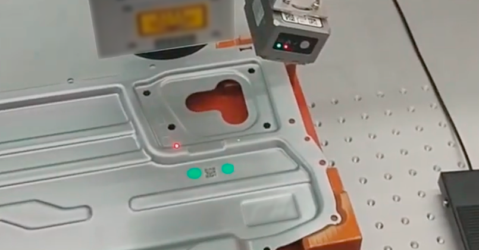- The leading new forces automakers
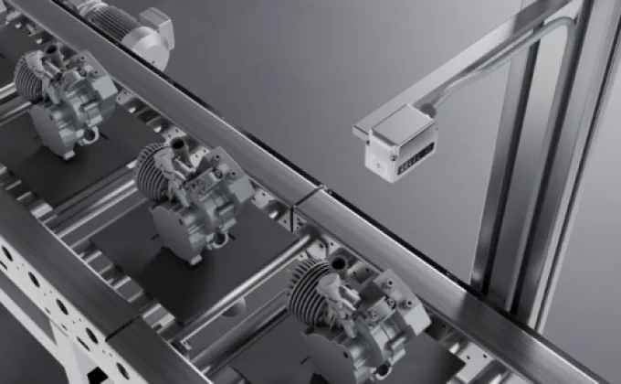- Defected DPM on engine
- Low Contrast DM on glass
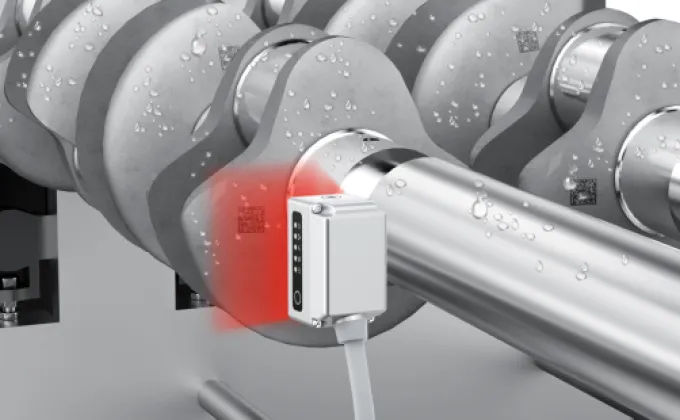- Water droplet on crankshaft
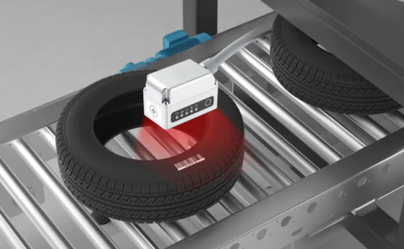- Barcode on tire
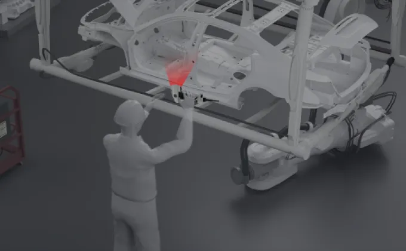- Handheld code reader reads automotive 1D/2D codes
- The new RS100 uses one-click debugging + adaptive algorithm to stably read large-angle tilted paper DM codes.
.png)- The new computing R275-A uses its self-developed machine vision algorithm engine™ and its super-resolution algorithm™ to stably read low-contrast and small-size DM codes.
- The leading new forces automakers
- Defected DPM on engine
- Low Contrast DM on glass
- Water droplet on crankshaft
- Barcode on tire
- Handheld code reader reads automotive 1D/2D codes
- The new RS100 uses one-click debugging + adaptive algorithm to stably read large-angle tilted paper DM codes.
.png)- The new computing R275-A uses its self-developed machine vision algorithm engine™ and its super-resolution algorithm™ to stably read low-contrast and small-size DM codes.

- [Button: ]
- [Button: ]
- [Button: ]
- [Button: ]

- Lithium New Energy
- 
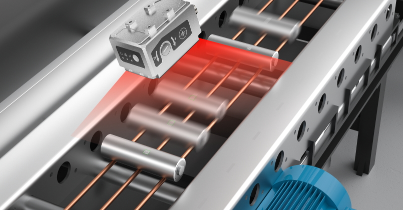- DPM on cylindrical Cell
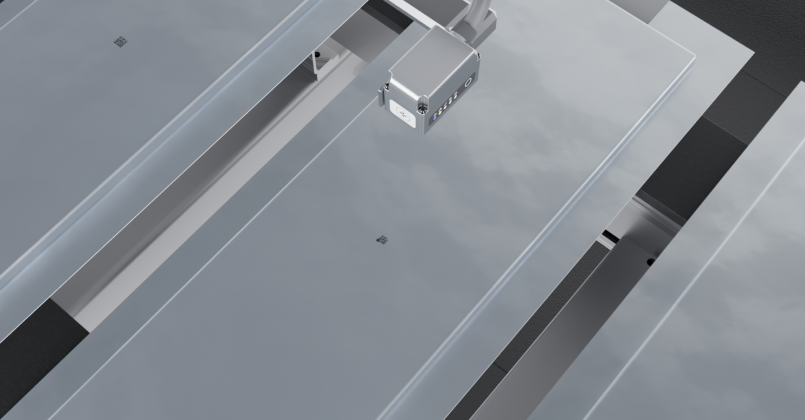- DPM on pouch cell
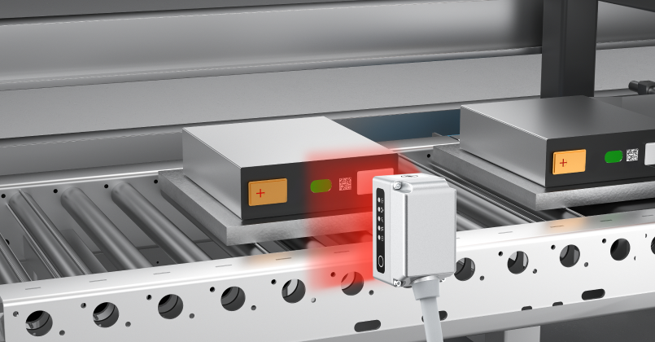- DPM on prismatic cell
- 3C Electronics
.png)- Network equipment manufacturers
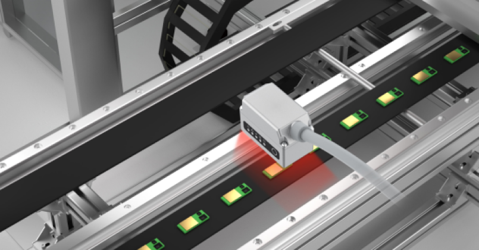- 0.5mm barcode on electronic components
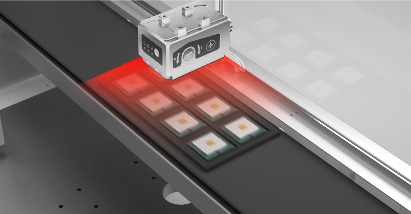- Movement reading of DM on multiple ICs
- Semiconductor
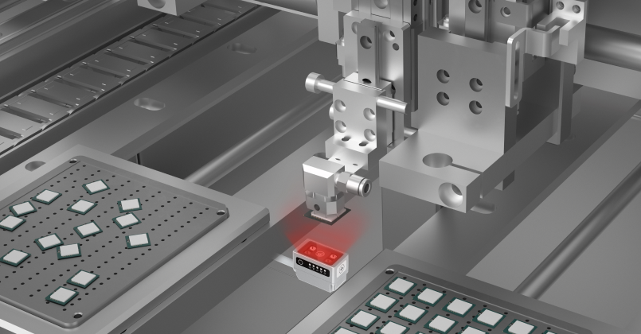- Reading DPM codes in tight spaces
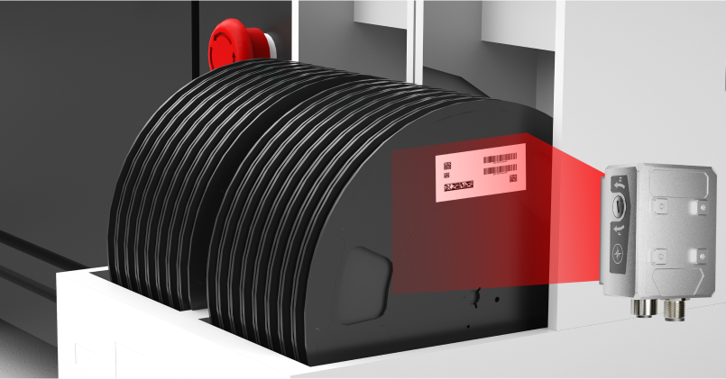- Read multiple 1D/2D barcodes simultaneously
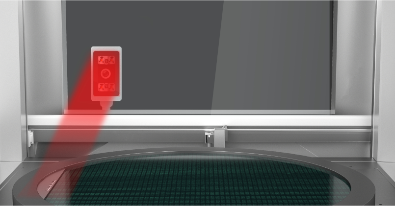- Read wafer tray barcodes through the glass
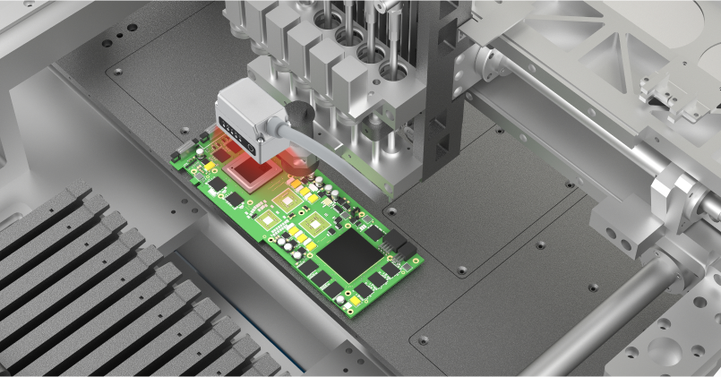- Reads low-contrast DPM barcodes
- Logistics and warehousing
[Button: ][Button: ].png)- Instrumentation integrator
.png)- Transmission equipment integrator
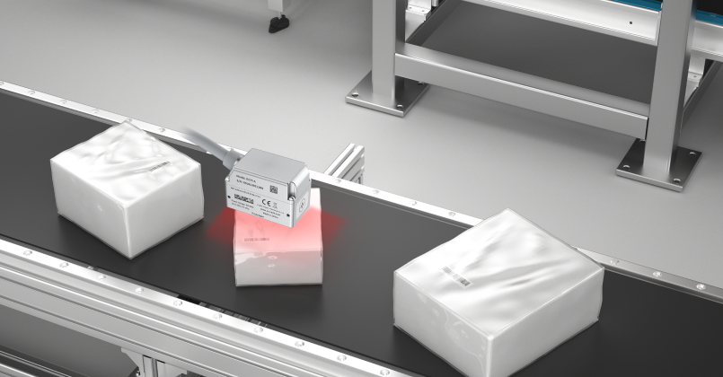- Express box plastic film to cover the bar barcode
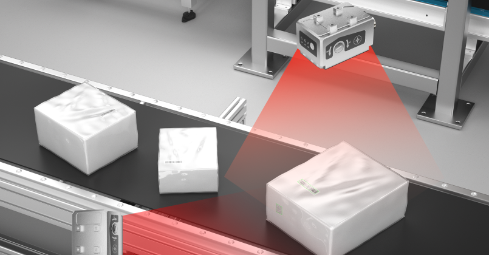- Multi-drop function
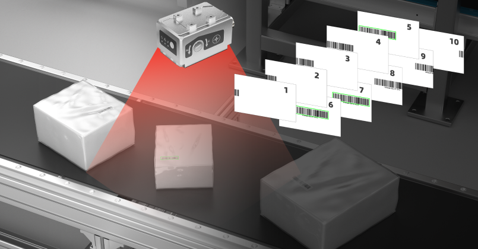- Burst mode
.png)- Instrumentation integrator
.png)- Transmission equipment integrator
- Express box plastic film to cover the bar barcode
- Multi-drop function
- Burst mode

- [Button: ]
- [Button: ]
- [Button: ]
- [Button: ]

- Photovoltaic New Energy
.png)- Photovoltaic equipment provider
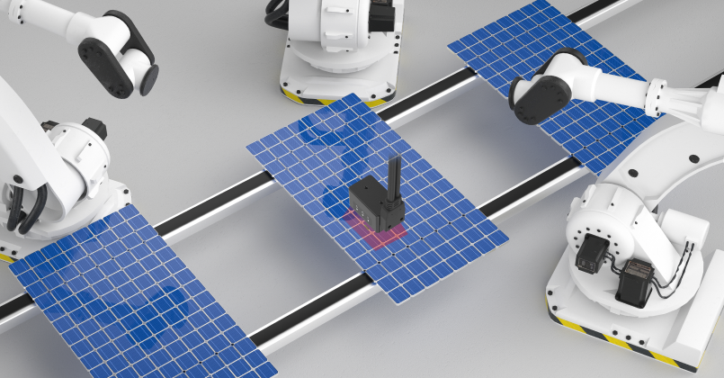- Photovoltaic panel barcode
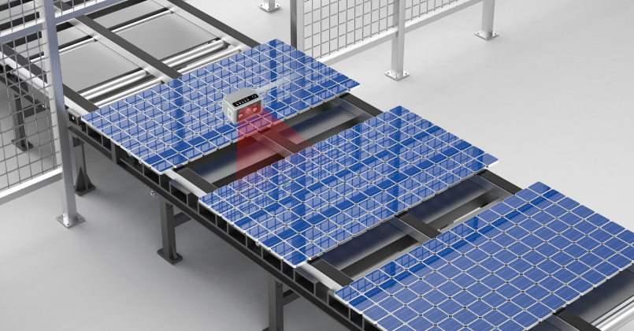- Photovoltaic panels are difficult to read
- Contact us for more product information and cooperation details
[Button: Prototype trial / Demo]- Hotline ：15381991195