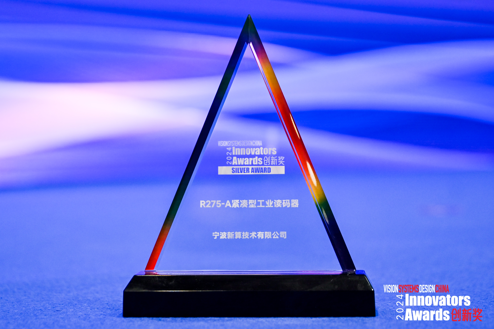
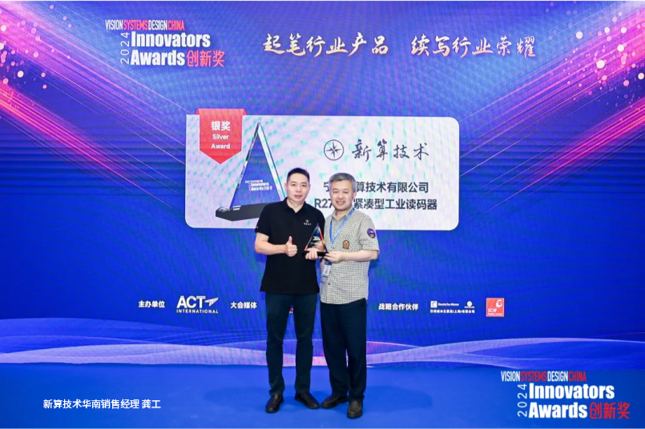
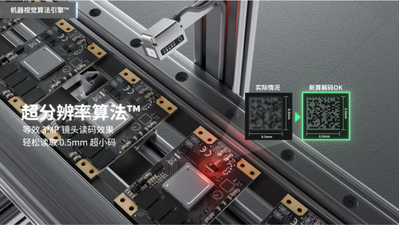

# 宁波新算技术有限公司

> Source: https://www.xs-code.com/#/detail/1

## 提取的关键数据

**电话:** 15381991195, 20230177

---

- Industrial Barcode Reader
- Techmology
- Customer Case
- Company Information
- Compact R-Series
- R275-A
- R172-E/S
- Dual Aviation plugs RS-Series
- RS100
- RS200
- RS60
- Handheld H-Series
- H920 无线/有线
- H620 无线/有线
- Aboutus
- News
- Exhibition
- Contact us
Customer reporting[Input(text): ]EnglishVSDC Innovators Awards 2024 创新奖揭晓！新算技术获行业权威认可
- 
- 
- 

2024-06-19 15:47

2024 年 6 月 19 日，深圳——全球知名工业视觉领域权威奖项《视觉系统设计》创新奖 2024 (VSDC Innovators Awards 2024) 隆重揭晓，新算凭借旗舰款 R275-A 紧凑型工业读码器一举获奖。这一荣誉不仅是对新算产品卓越性能的肯定，更是对新算在工业机器视觉领域不断创新、追求卓越的高度认可。

《Vision Systems Design》举办的 Innovators Awards 在全球机器视觉行业享有盛誉，旨在表彰在产品或技术、应用程序或研发方面表现卓越的机器视觉行业公司。该奖项的专家评审团由系统集成商、顾问和行业学者组成。今年的奖项经过 15 位专家评委及近 50 位业界大众评委的评分评定，新算 R275-A 紧凑型工业读码器在众多参赛产品中脱颖而出，获得本次评选中读码器品类的最高奖项。

新算 R275-A 紧凑型工业读码器采用了自主知识产权的机器视觉算法引擎™，结合一键调试 OneClick 功能，大幅提高了解码的稳定性和性能。其具备超小尺寸的特点，便于在各种环境中安装和部署。R275-A 不仅满足了工业现场对高性能、易操作的读码器需求，同时展现了新算在软硬件设计上的独立自主和技术领先。

新算 R275-A 适用于 3C 电子、半导体、汽车制造等行业，目前已成功应用于头部知名消费电子品牌 TWS 耳机生产产线、高精尖半导体设备芯片分拣机中。此外，凭借出色的激光刻印 DM 码、镭雕 DM 码识读性能，R275-A 在汽车制造行业也尤为适用。 未来，新算将持续致力于技术研发和产品创新，不断提升产品性能，为客户提供更加优质的解决方案。

新算技术，深耕于工业机器视觉传感器领域，具备完全独立自主知识产权的解码识读算法。公司以研发为导向，在视觉算法、硬件设计上已做到完全的独立自主，目前已向市场推出多系列高性能固定式工业读码器、手持式工业读码器等多条产品线，在 3C 电子、汽车、新能源及半导体等工业制造领域积累了丰富的行业服务经验。

相关新闻- Contact us for more product information and cooperation details
[Button: Prototype trial / Demo]- Hotline ：15381991195