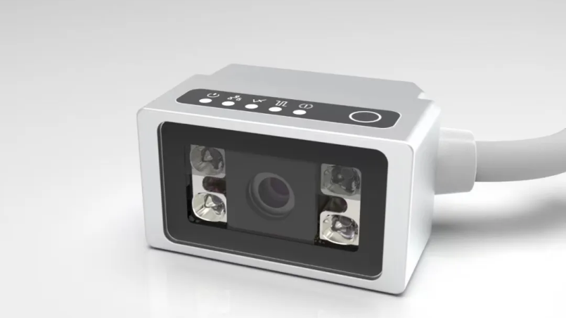

# 宁波新算技术有限公司

> Source: https://www.xs-code.com/#/detail/3

## 提取的关键数据

**电话:** 15381991195, 20230177

---

- Industrial Barcode Reader
- Techmology
- Customer Case
- Company Information
- Compact R-Series
- R275-A
- R172-E/S
- Dual Aviation plugs RS-Series
- RS100
- RS200
- RS60
- Handheld H-Series
- H920 无线/有线
- H620 无线/有线
- Aboutus
- News
- Exhibition
- Contact us
Customer reporting[Input(text): ]English专注先进工业传感器，「宁波新算」完成Pre-A轮融资｜早起看早期
- 文｜杨逍
- 编辑｜苏建勋
- 

2023-07-10 08:18

新算已经在2023年上半年完成了对多个包括3C、新能源以及汽车产线客户的量产交付。

近日，36氪获悉，先进工业传感器公司新算技术宣布完成PreA轮融资，该轮由顺为资本领投，华方资本和老股东红杉中国跟投。新算技术团队在一年内连续完成两轮融资，累计获得亿元级融资规模。蔚澜资本担任公司长期独家资本顾问。本轮融资资金将用于投入进一步提升工业读码器等核心产品的量产产能，并加大在先进工业视觉传感器领域的多品类研发。目前，全球工业传感器市场规模超过500亿美元，并且保持10%年增长率，预计到2023年底全球市场规模将超过600亿美元；

随着国内工业自动化水平提升，中国工业传感器市场规模也达到了近550亿元人民币，年增速超过16%，远高于全球增速。同时，中国市场的工业传感器，尤其是高端制造用到的传感器，在相当长时间里一直被美日德系公司垄断。

以工业传感器领域的大单品之一工业读码器领域为例，基恩士(Keyence)、康耐视(Cognex)以及得利捷(Datalogic)等知名国际品牌垄断了中国先进读码器领域十年以上时间，而国内品牌在算法的积累上一直相对薄弱，对于解码率和稳定性要求极高的工业场景一直无法切入。但与此同时，随着中国整体制造水平的不断提升，包括新能源电池制造、新能源汽车的整车制造，以及高端3C产品等生产对于精度和效率越来越高，原有国产读码器品牌更是难以打开局面，始终在“代理贴牌”和一些中低端的场景打价格竞争。而新算创始团队选择在技术最难、门槛最高、切入容错率最低的工业读码器产品切入市场，新算创始人张苏宁告诉36氪：“只有在最难的单品上立住脚，正面PK海外大厂的核心产品，国产工业传感器才有机会真正树立自己的品牌价值。”

新算团队在算法上积累了近8年的时间，测试了海量的工业读码场景，在去年成功推出新算读码器R275-A和R270-A系列等产品。2023年，新算已经实现了读码器产品的量产以及品控测试的验证，并且顺利进入了多个具代表性的高端3C产品制造商及新能源大厂供应商名录。张苏宁表示：“新算同时已经成为多个制造业终端的独家供应商，在海外品牌垄断几乎十年以上的市场里，从正面撕开了一个口子。”

算法技术上，新算自研了ISP前处理算法“像素自适应增强算法”，对百万级分辨率的图像输入进行超分辨率处理，在亚像素级的定位任务中，为了获取更多的输入像素信息以实现更好的分辨率重建，用了混合注意力机制的Transformer模型。在实现自适应增强的同时，结合了通道注意力及所有窗口信息的自注意力方案，从而充分利用了它们各自的优势，即能够利用全局统计和强大的局部拟合能力。张苏宁表示，在新算特有的‘像素自适应增强算法’帮助下，R275-A和R270-A系列固定式读码器利用百万级图像传感器输入可达到300万像素的图像质量。目前新算的产品已经在2023年上半年完成了对多个包括3C、新能源以及汽车产线客户的量产交付，预计在2023年创始团队表示会完成数万台产品的交付，同时团队已经开始了基于已经积累的算法优势开发物流、仓储以及机器人等场景的读码产品。

投资人说： 顺为资本合伙人程天：“随着工业4.0时代到来，智能制造和工业自动化成为国家产业升级的重点战略方向。代码之于制造生产，如同所有零部件的‘电子身份证’，是唯一不变的身份标识。工业读码器作为高端制造领域的‘卡脖子’设备器材，国内市场长期被外资品牌垄断，政策引导方向明确，国产替代趋势清晰。未来受益于锂电池、新能源车、精密制造等下游产业的持续拉动，市场发展前景广阔。新算旗下产品性能出众，首款读码器在解码率、读取对比度、破损图形识别等维度均已比肩国际头部品牌。创始人张苏宁具备丰富的高端工业读码器开发经历及商业化落地经验，期待团队继续深耕工业机器视觉领域，用高品质兼具性价比的产品，填补国内市场空白，助力先进制造转型升级大趋势”华方资本合伙人路驰：“各类工业传感器是国内产业数字化转型的基石，是数据的来源。

相关新闻- Contact us for more product information and cooperation details
[Button: Prototype trial / Demo]- Hotline ：15381991195