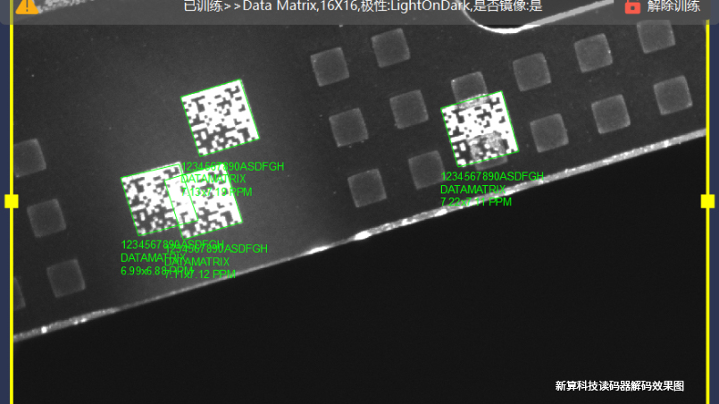

# 宁波新算技术有限公司

> Source: https://www.xs-code.com/#/detail/6

## 提取的关键数据

**电话:** 15381991195, 20230177

---

- Industrial Barcode Reader
- Techmology
- Customer Case
- Company Information
- Compact R-Series
- R275-A
- R172-E/S
- Dual Aviation plugs RS-Series
- RS100
- RS200
- RS60
- Handheld H-Series
- H920 无线/有线
- H620 无线/有线
- Aboutus
- News
- Exhibition
- Contact us
Customer reporting[Input(text): ]English「新算科技」获数千万元天使轮融资，由红杉中国种子基金独家投资
- 文｜周倩
- 编辑｜彭孝秋
- 

2022-07-22 08:15

36氪获悉，工业读码与传感器生产商「新算科技」于近日获数千万元天使轮融资，本轮融资投资方为红杉中国种子基金，融资资金将用于工厂建设、产品品控管理及供应链体系建设。

「新算科技」成立于2019年，主要专注于图像处理算法的研发与读码产品的设计，面向3C、新能源、汽车、仓储、智能物流、机器人、商超、支付与数字ID等行业，提供通用型DPM工业读码器、高速高性能工业读码器和高性价比读码模组。据Grand View Research报告数据，2021年读码器全球市场规模约70亿美元，预计2028年将达到110亿美元，年复合增长率为6.7%，亚太地区在2020年主导了市场，占全球读码器市场份额达到40%。但一直以来全球工业读码器市场被主要厂商包括基恩士（Keyence）、康耐视（Cognex）、得利捷（Datalogic）等国外品牌占据，提升读码器的技术壁垒也是各个视觉传感龙头企业的核心任务。在「新算科技」创始人张苏宁看来，目前国内单纯在制造业上使用的工业读码器仍以进口品牌为主，新算科技以读码器为切入点，不断扩充产品系列，依凭视觉算法和硬件设计能力，加上本土企业服务速度超越国外品牌的优势，仍然有机会成为和国外龙头相抗衡的本土视觉传感器公司，为工厂的信息化提供更好的解决方案。目前，「新算科技」已构建通用DPM读码器、读码模组、工业手持式读码器、支付模组以及读码芯片等多条产品线，已落地的两款产品分别是R270和R275系列读码器，两者性能均达到国际领先⽔平，并成功在A公司电池产线落地。「新算科技」读码器的核心优势是将神经网络和传统算法相结合，经过大量数据训练的神经网络可以抽象出二维码或条码的纹理特征，在各种复杂的场景下能够对二维码或者条码的区域先用AI将码先进行粗略定位，随后利用传统算法进行高速筛选进行精细定位，大幅度提高解码效率。其次，「新算科技」的算法能够做到无视图像的对比度变化和干扰，对二维码或者条码的边界进行亚像素级别的定位，定位精度可达0.02个像素点。总体来看，「新算科技」在ID定位或者解码的算法具备三大优势：高精度、抗干扰、适应性强。

36氪获悉，工业读码与传感器生产商「新算科技」于近日获数千万元天使轮融资，本轮融资投资方为红杉中国种子基金，融资资金将用于工厂建设、产品品控管理及供应链体系建设。「新算科技」成立于2019年，主要专注于图像处理算法的研发与读码产品的设计，面向3C、新能源、汽车、仓储、智能物流、机器人、商超、支付与数字ID等行业，提供通用型DPM工业读码器、高速高性能工业读码器和高性价比读码模组。据Grand View Research报告数据，2021年读码器全球市场规模约70亿美元，预计2028年将达到110亿美元，年复合增长率为6.7%，亚太地区在2020年主导了市场，占全球读码器市场份额达到40%。但一直以来全球工业读码器市场被主要厂商包括基恩士（Keyence）、康耐视（Cognex）、得利捷（Datalogic）等国外品牌占据，提升读码器的技术壁垒也是各个视觉传感龙头企业的核心任务。在「新算科技」创始人张苏宁看来，目前国内单纯在制造业上使用的工业读码器仍以进口品牌为主，新算科技以读码器为切入点，不断扩充产品系列，依凭视觉算法和硬件设计能力，加上本土企业服务速度超越国外品牌的优势，仍然有机会成为和国外龙头相抗衡的本土视觉传感器公司，为工厂的信息化提供更好的解决方案。目前，「新算科技」已构建通用DPM读码器、读码模组、工业手持式读码器、支付模组以及读码芯片等多条产品线，已落地的两款产品分别是R270和R275系列读码器，两者性能均达到国际领先⽔平，并成功在A公司电池产线落地。「新算科技」读码器的核心优势是将神经网络和传统算法相结合，经过大量数据训练的神经网络可以抽象出二维码或条码的纹理特征，在各种复杂的场景下能够对二维码或者条码的区域先用AI将码先进行粗略定位，随后利用传统算法进行高速筛选进行精细定位，大幅度提高解码效率。其次，「新算科技」的算法能够做到无视图像的对比度变化和干扰，对二维码或者条码的边界进行亚像素级别的定位，定位精度可达0.02个像素点。总体来看，「新算科技」在ID定位或者解码的算法具备三大优势：高精度、抗干扰、适应性强。 此外，「新算科技」还将研发用于图像处理且自带读码功能的专用芯片，替换现有产品的外采芯片，降低功耗和成本，使视觉传感器产品实现供货稳定的同时产品力也将得以大幅提升。在此次融资完成后，「新算科技」将在南京和宁波设立工厂，两条柔性生产线同时兼顾多款产品的生产。目前公司有意向合作的代理销售商有十几家，主要分布在华东、华南和西部地区。团队方面，创始人张苏宁曾负责新世电子的AGV惯性导航传感器与视觉导引传感器项目，2017年底创⽴常州深图图像技术有限公司，负责⼯业图像处理算法设计与图像式读码器算法设计；CTO周岩为芯⽚领域专家，曾就职于Synopsys、⼩⽶、中星微、新岸线等多家知名芯⽚公司，曾带领设计团队负责过多款⼿机芯⽚、超⼤规模应⽤处理器SOC芯⽚的研发。团队核心成员皆是“NXP杯”智能车竞赛摄像头组国赛一等奖成员，深耕图像处理算法长达7年。

红杉中国合伙人张涵表示：新一代制造业革命是重塑产业链价值的过程，这意味着产业链上的每一个环节都需要做智能化数字化升级，每个产品都需要可标识与可追溯。工业读码器和视觉传感器在工业数字化升级的过程中发挥了至关重要的作用。我们相信新算科技在张总的带领下，依靠自身强大的研发和工程能力，打造国有高端自主品牌，迅速实现读码和传感设备在仓储、物流、工业自动化领域的规模化落地，为客户与合作伙伴持续创造价值。

相关新闻- Contact us for more product information and cooperation details
[Button: Prototype trial / Demo]- Hotline ：15381991195