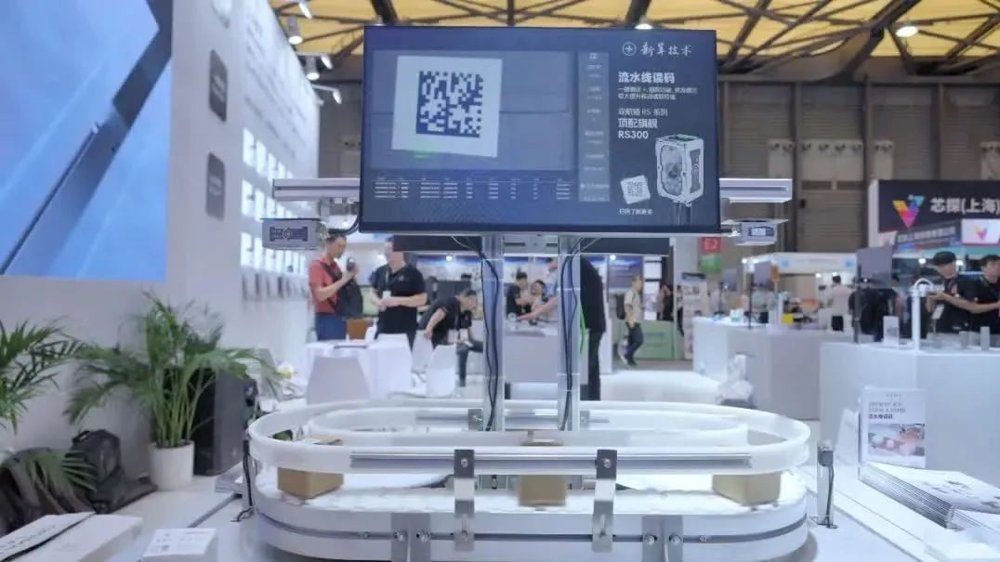
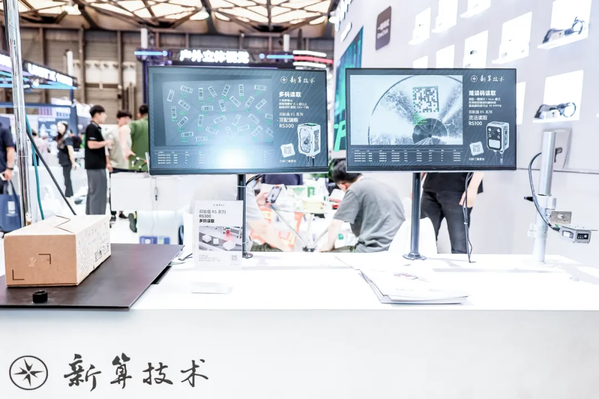

# 宁波新算技术有限公司

> Source: https://www.xs-code.com/#/detail/7

## 提取的关键数据

**电话:** 15381991195, 20230177

---

- Industrial Barcode Reader
- Techmology
- Customer Case
- Company Information
- Compact R-Series
- R275-A
- R172-E/S
- Dual Aviation plugs RS-Series
- RS100
- RS200
- RS60
- Handheld H-Series
- H920 无线/有线
- H620 无线/有线
- Aboutus
- News
- Exhibition
- Contact us
Customer reporting[Input(text): ]English新算技术首度亮相 VCSH 2024，读码器全产品助力工业自动化
- 
- 
- 

2024年07月19日

中国（上海）机器视觉展 VCSH 2024 圆满落幕，新算技术携工业读码器全产品亮相，一起回顾展会精彩瞬间！

01 六大场景，展现卓越产品性能

RS300&RS100 流水线读码 一键调试+ 搭配专为移动读码场景开发的组网功能、突发模式读码，极大提升读码器移动读取性能。

RS300 高速读取 顶配旗舰 RS300 开启一键调试+ Quick 模式，即使 5M/S 的高速流水线也能稳定读取。

.jpeg)

RS300 多码读取 & RS100 难读码读取 顶配旗舰 RS300 配备大视野镜头，最高可同时读取 100+ 个 1D/2D 码； 开启一键调试+ Max 模式，实现极致难读码解码率。

R275-A 自动对焦 紧凑旗舰 R275-A 配备先进液态镜头，可实现毫秒级自动对焦。

.jpeg)

R275-A 难读码读取 紧凑旗舰 R275-A 可通过一键调试 OneClick × 超分辨率算法™，实现等效 3MP 镜头读码效果，轻松读取低至 0.5mm 超小码。

.webp)

H920 无线/有线手持读码 搭载旗舰级同轴瞄准及训练功能的 H920 无线/有线读码器，能够极大提升解码景深、解码速度及解码率。

.webp)

02 备受关注 新算获权威媒体认可

.webp)

此次 VCSH 机器视觉展吸引了七万多名观众，新算展台备受瞩目。

中国自动化、数字化及智能制造领域的权威媒体工控网在直播采访时提到“新算拥有独特的视觉算法、卓越的硬件设计和高效的本土化服务。”

.webp)

美国领先的媒体品牌《Vision Systems Design》中国版谈到新算，“工业视觉领域 AI 大规模落地应用，新算未来发展让人期待。”

.webp)

03 精彩瞬间

.webp)

新算技术 2024 年 VCSH 机器视觉展完美收官。很高兴与新老客户、合作伙伴相遇，下次展会见！

关于新算技术

新算技术，深耕于工业机器视觉传感器领域，具备完全独立自主知识产权的解码识读算法。公司以研发为导向，在视觉算法、硬件设计上已做到完全的独立自主，目前已向市场推出多系列高性能固定式工业读码器、手持式工业读码器等多条产品线，在 3C 电子、汽车、新能源及半导体等工业制造领域积累了丰富的行业服务经验。

相关新闻- Contact us for more product information and cooperation details
[Button: Prototype trial / Demo]- Hotline ：15381991195