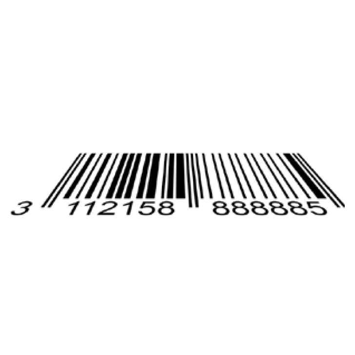

# 宁波新算技术有限公司

> Source: https://www.xs-code.com/#/goods/H620

## 提取的关键数据

**电话:** 15381991195, 20230177

---

- Industrial Barcode Reader
- Techmology
- Customer Case
- Company Information
- Compact R-Series
- R275-A
- R172-E/S
- Dual Aviation plugs RS-Series
- RS100
- RS200
- RS60
- Handheld H-Series
- H920 无线/有线
- H620 无线/有线
- Aboutus
- News
- Exhibition
- Contact us
Customer reporting[Input(text): ]English- Back
- H620 Industrial Barcode Reader
- H620-U2F5SRDRB
- H620-U2F7HDDRB
- H620-ES2F5SRDRB
- 
- 
[Button: Prototype trial / Demo][Button: ][Button: ].png).png).png).png).png).png).png).png).png).png).png).png)
- [Button: ]
- [Button: ]
- [Button: ]
- [Button: ]

[Button: - Outstanding barcode reading performance]- Using the self-developed patented handheld algorithm engine, it can achieve more than 99.9% decoding for various difficult codes in complex industrial scenarios rate to ensure the efficient operation of the production line
[Button: - 3x high-speed decoding × one-click training]- It supports fast batch decoding of paper codes, inkjet codes and DPM codes, which is more than 3 times faster than that of products of the same level, and is equipped with one-click training technology to further improve the decoding speed
[Button: - Flexible lighting options]- Equipped with switchable direct red/blue light and uniform light, it effectively improves the image quality of barcode reading, ensuring fast and accurate reading of 1D/2D codes against different material or color backgrounds
[Button: - Decode the case][Button: ][Button: ]- Angular distortion
.png)- bleeding
.png)- 20% low contrast
.png)- Metal engraving
- Angular distortion
.png)- bleeding
.png)- 20% low contrast
.png)- Metal engraving

- [Button: ]
- [Button: ]
- [Button: ]
- [Button: ]

- Contact us for more product information and cooperation details
[Button: Prototype trial / Demo]- Hotline ：15381991195