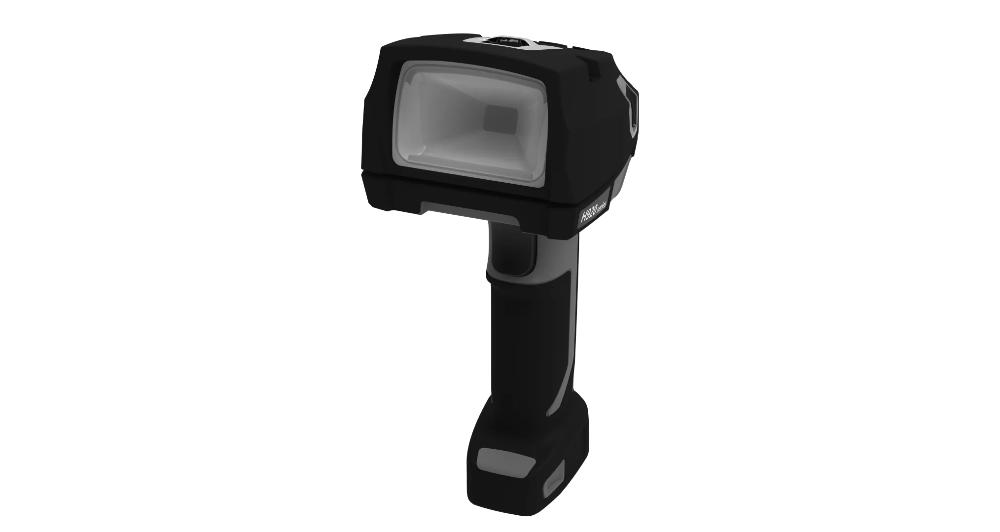
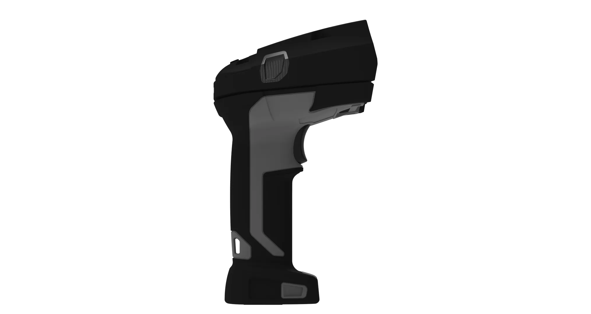
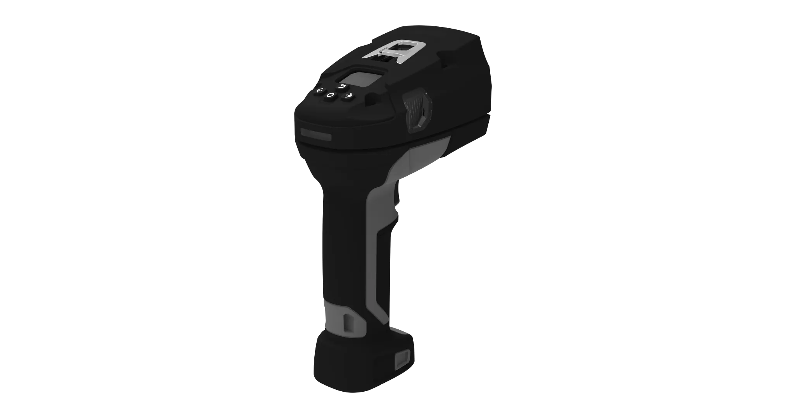
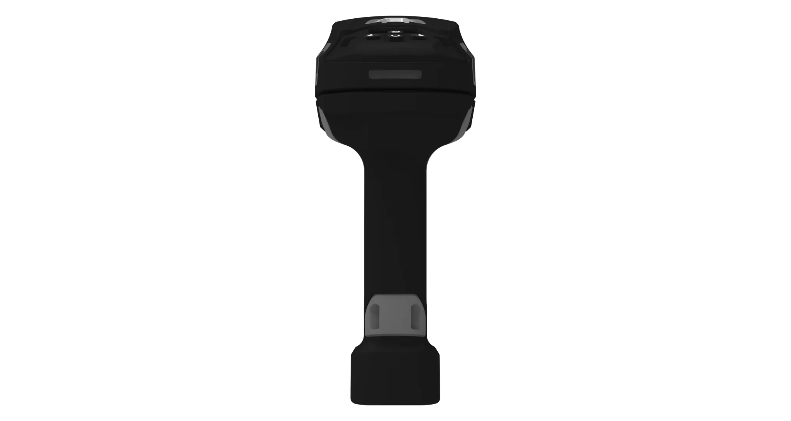
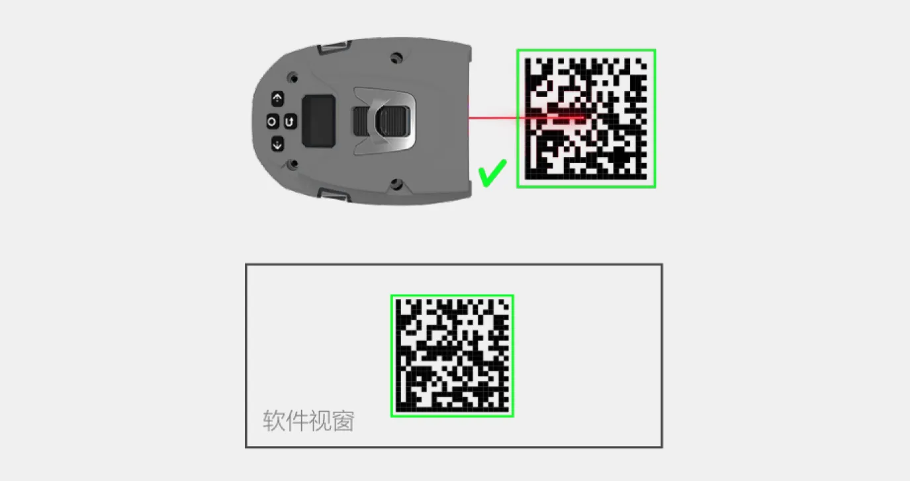
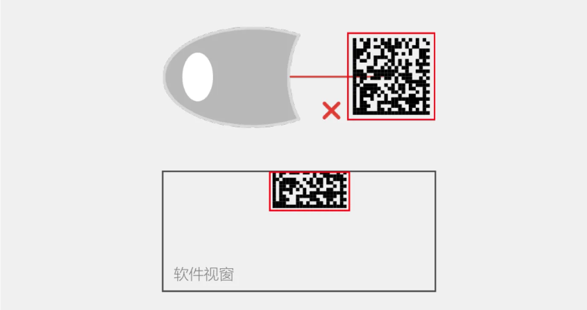
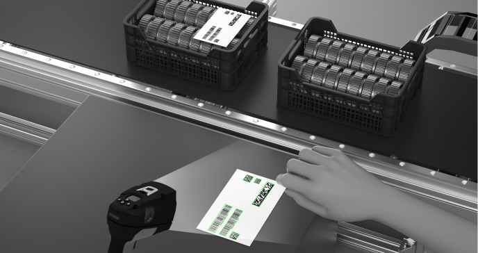
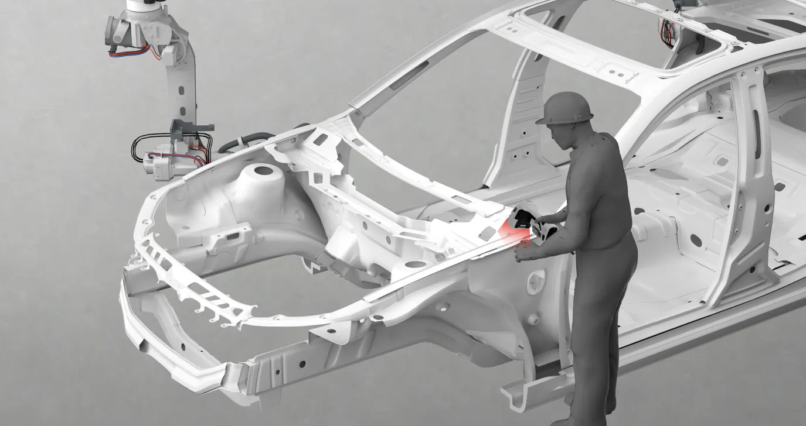
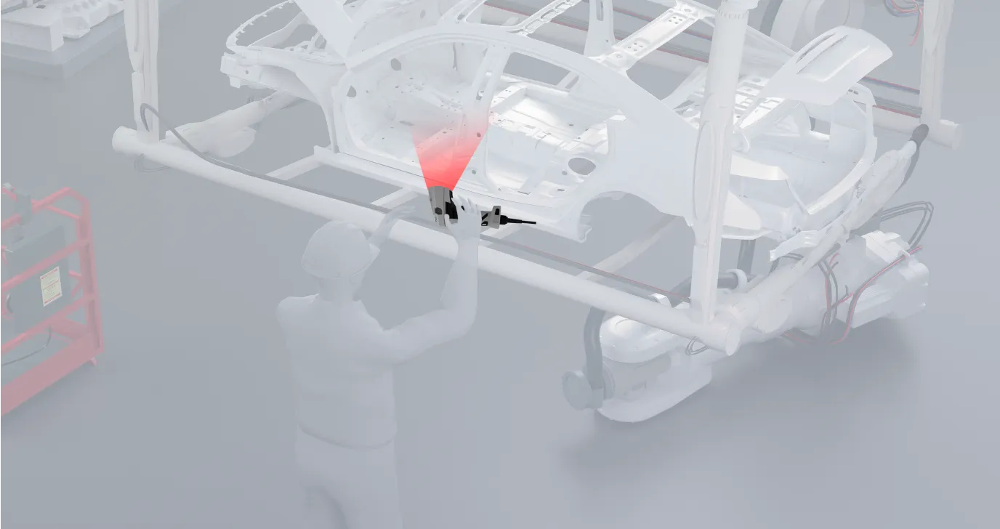

# 宁波新算技术有限公司

> Source: https://www.xs-code.com/#/goods/H920

## 提取的关键数据

**电话:** 15381991195, 20230177

---

- Industrial Barcode Reader
- Techmology
- Customer Case
- Company Information
- Compact R-Series
- R275-A
- R172-E/S
- Dual Aviation plugs RS-Series
- RS100
- RS200
- RS60
- Handheld H-Series
- H920 无线/有线
- H620 无线/有线
- Aboutus
- News
- Exhibition
- Contact us
Customer reporting[Input(text): ]English- Back
- H920 Wireless/Wired Barcode Reader
- H920 无线/有线
- Patented Handheld Algorithm Engine × On-axis Aiming × Training Function
- 
[Button: Prototype trial / Demo][Button: ][Button: ]
- [Button: ]
- [Button: ]
- [Button: ]
- [Button: ]

[Button: - Patented Handheld Algorithm Engine]- Algorithm Engine Mobi Designed for Handheld Reading × Diffused Lighting Technology Easy to deal with all kinds of difficult to read barcodes
[Button: ][Button: ]- Metal engraving
- Dirt
- Shiny on Background
- Metal Scratch
- bleeding
- Wear

- [Button: ]
- [Button: ]
- [Button: ]

[Button: - On-axis Aiming]- Flagship Aiming Performance Completely improve the traditional handheld barcode reader aiming shift problem, no longer worry about missing scanning errors
- 
- 
[Button: - Training Function]- XinSuan Tech's exclusive training function greatly improves efficiency Train the 1D/2D barcodes to be read to improve the decoding depth of field, decoding speed and decoding rate, and when the training is completed, the reading of the same kind of code can reach instantaneous reading
[Button: - Compact Integrated design]- Professional industrial design, better understanding of on-site factory usage
.png)[Button: - Applications]- Automobile manufacturing
- Automobile manufacturing
- Contact us for more product information and cooperation details
[Button: Prototype trial / Demo]- Hotline ：15381991195