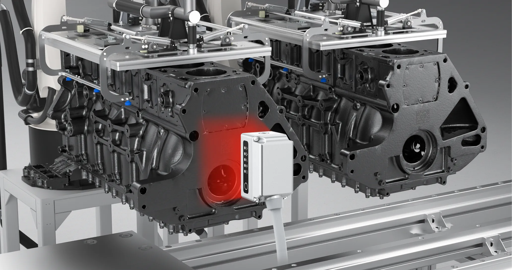
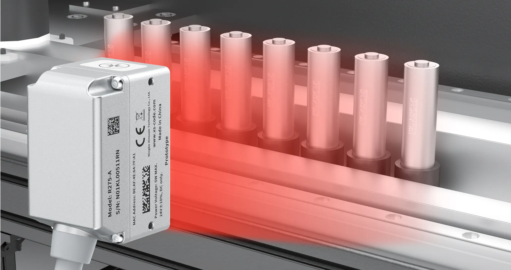
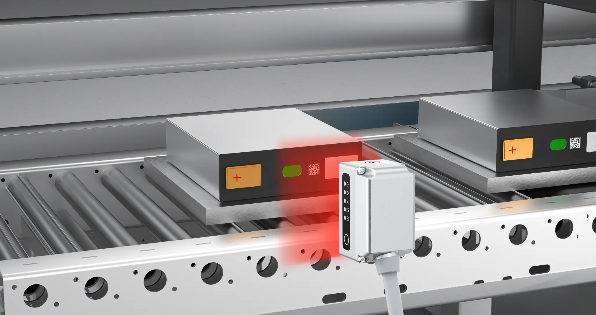
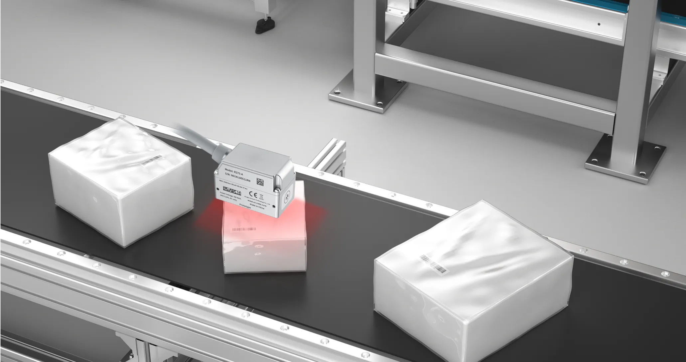
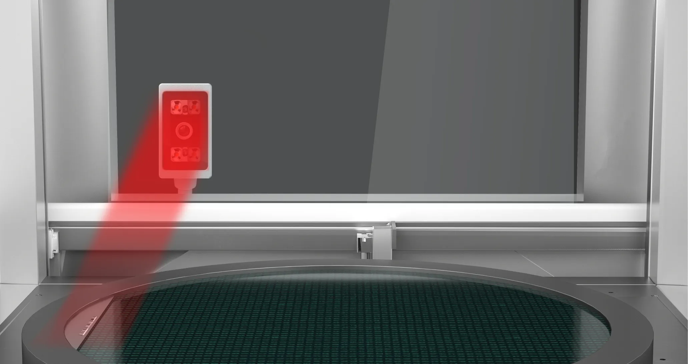
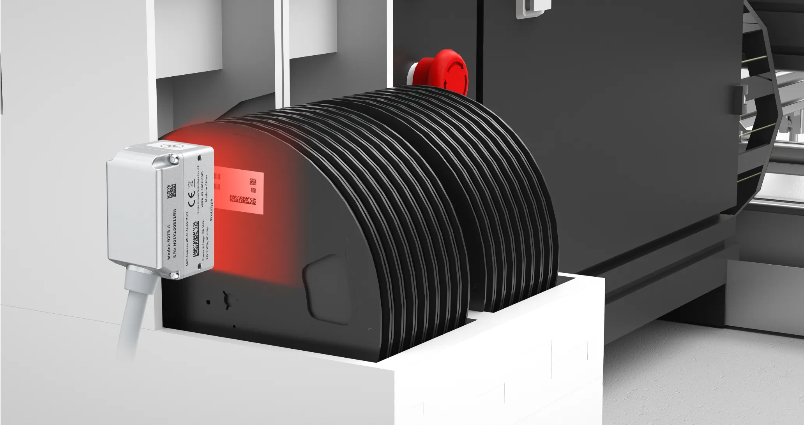

# 宁波新算技术有限公司

> Source: https://www.xs-code.com/#/goods/R275-A

## 提取的关键数据

**电话:** 15381991195, 20230177

---

- Industrial Barcode Reader
- Techmology
- Customer Case
- Company Information
- Compact R-Series
- R275-A
- R172-E/S
- Dual Aviation plugs RS-Series
- RS100
- RS200
- RS60
- Handheld H-Series
- H920 无线/有线
- H620 无线/有线
- Aboutus
- News
- Exhibition
- Contact us
Customer reporting[Input(text): ]English- Back
- R275-A

## Compact R-Series Barcode Reader

- Powerful Decoding Engine × OneClick × Ultra-Compact
[Button: Try&Contact us][Button: Video]

[Video: assets/goods-r275-a/video2.mp4]

[Button: ][Button: ]- Fully transparent tempered windows
- Optical Coating + Tempered Window = Clear Readability and Ruggedness
- New geometric optical design
- Professionally designed silver-plated parabolic reflector for more stable barcode reading
- Specializing in polarized filter lighting
- Reduces light interference and stabilizes barcode reading
- Multi-ROI Configuration Function
- Stable reading even in multi-barcode environments
- Advanced Heterogeneous Processing System
- Improve decoding performance and reduce power consumption
- DSP performance optimization
- optimized DSP for challenging barcodes
- Fully transparent tempered windows
- Optical Coating + Tempered Window = Clear Readability and Ruggedness
- New geometric optical design
- Professionally designed silver-plated parabolic reflector for more stable barcode reading
- Specializing in polarized filter lighting
- Reduces light interference and stabilizes barcode reading
- Multi-ROI Configuration Function
- Stable reading even in multi-barcode environments
- Advanced Heterogeneous Processing System
- Improve decoding performance and reduce power consumption
- DSP performance optimization
- optimized DSP for challenging barcodes

- [Button: ]
- [Button: ]
- [Button: ]
- [Button: ]

[Button: ][Button: ]

[Video: assets/goods-r275-a/20240903120757246_r275a-x2.mp4]

- 0.5mm ultra-small size
- Barcodes for electronic parts are getting smaller and smaller. The R275-A with Ultra-resolution algorithm™️ is able to read ultra-small barcodes consistently

[Video: assets/goods-r275-a/20240903123255753_r275a-x1.mp4]

- L-shaped breakage 30%
- Even with 30% breakage of the finder pattern (L-shaped), SPL Technology™ can easily read
- The firing pin is of different depths
- Metal castings of the firing pin marking process will affect the quality of the bar barcode, the use of new algorithms of powerful image processing capabilities can achieve stable reading
- Curved Reflective
- The DPM barcode on the curved metal surface is prone to reflections that interfere with decoding, and can be stabilized by reducing reflections through polarizing filters
- Brushed metal material
- Barcodes can be difficult to read due to the brushed ferrous metal substrate, R275-A enhanced algorithms provide stable reads
- Plastic film masking
- Logistics parcels covered with film can cause the barcode reading can not be read, the powerful algorithm engine can solve this proble
- Read through the glass
- Precision equipment sometimes requires Industrial Barcode Reader to read through a glass window, which can be read by polarizing filters to reduce glass reflections
- Simultaneous reading of multiple barcodes
- SMT trays often have multiple types of barcodes, the R275-A supports multiple barcode systems and can read multiple different barcodes at the same time

- [Button: ]
- [Button: ]
- [Button: ]
- [Button: ]

- Contact us for more product information and cooperation details
[Button: Prototype trial / Demo]- Hotline ：15381991195