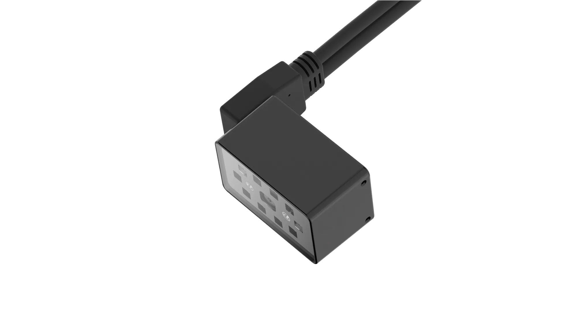
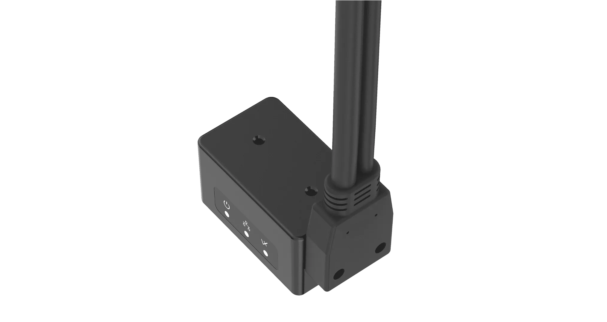
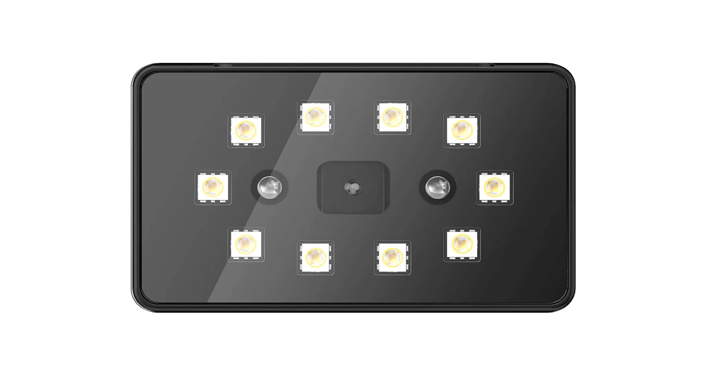
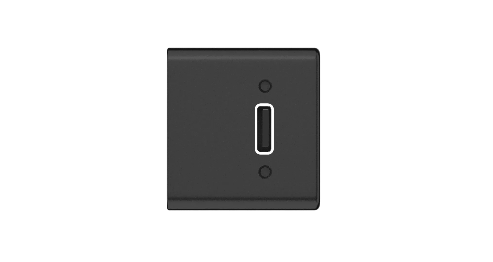
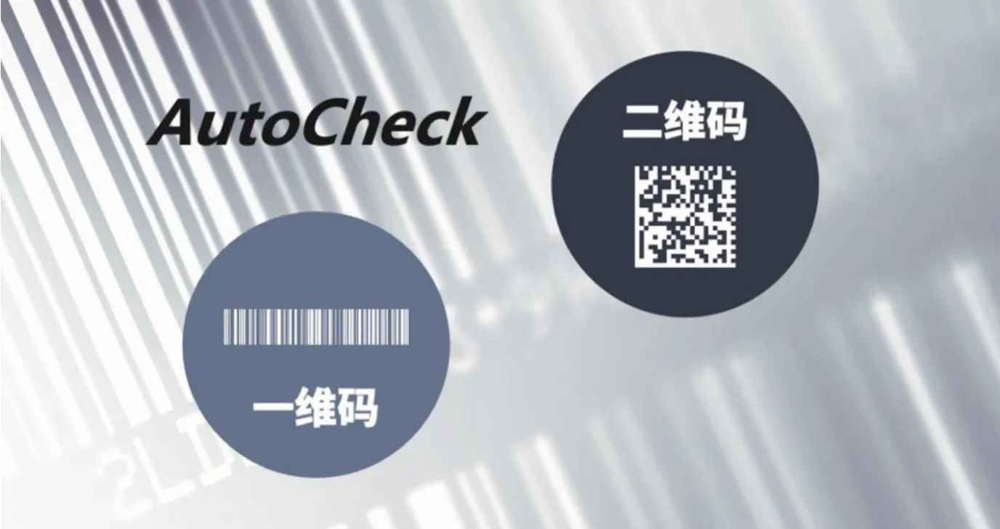
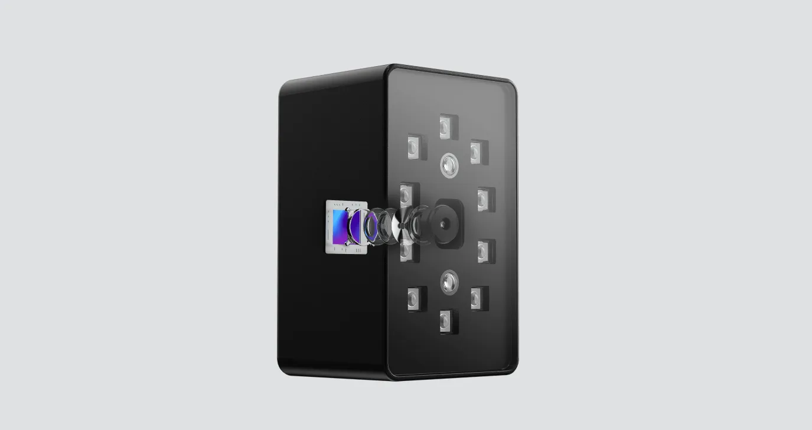
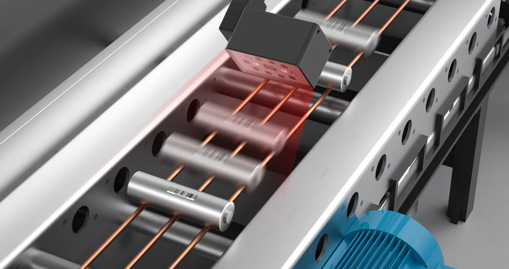
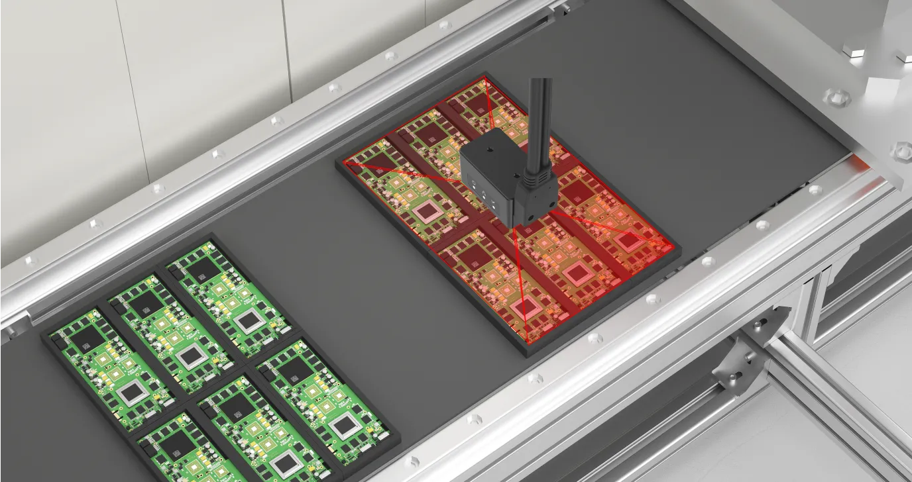
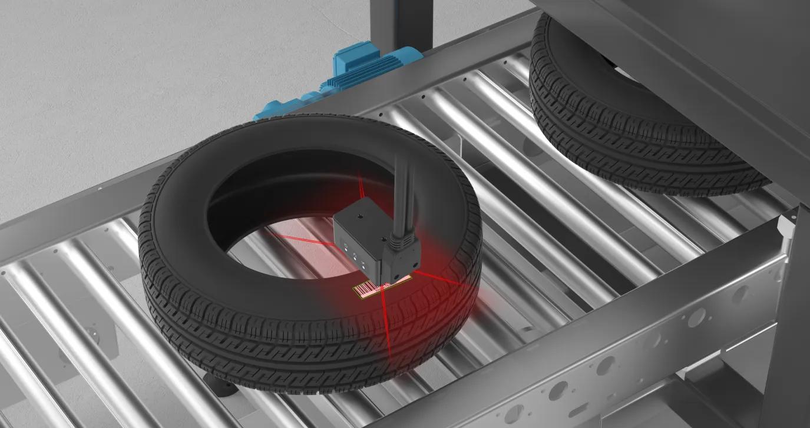
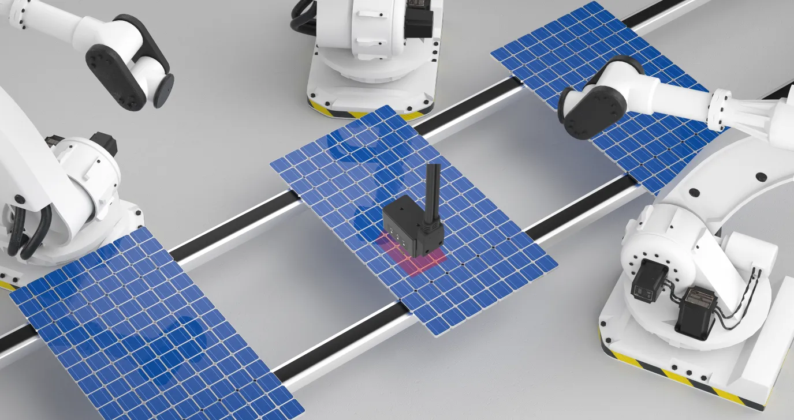

# 宁波新算技术有限公司

> Source: https://www.xs-code.com/#/goods/R90

## 提取的关键数据

**电话:** 15381991195, 20230177

---

- Industrial Barcode Reader
- Techmology
- Customer Case
- Company Information
- Compact R-Series
- R275-A
- R172-E/S
- Dual Aviation plugs RS-Series
- RS100
- RS200
- RS60
- Handheld H-Series
- H920 无线/有线
- H620 无线/有线
- Aboutus
- News
- Exhibition
- Contact us
Customer reporting[Input(text): ]English- Back
- R90 Series Compact Industrial Barcode Reader
- R90-E
- OneClick × Stable reading × Flexible deployment
- 
[Button: Prototype trial / Demo][Button: - OneClick]- Auto Parameter
- Over 86 million parameter configurations to automatically optimize exposure, gain and other parameters for challenging barcodes
- Auto Barcode Type Detection
- Automatically detect 1D barcode/2D barcode, according to the barcode type to call the predefined barcode template library, to improve the reading speed
[Button: - Stable reading]- 10 LED lighting ensures clear reading under various working conditions
[Button: - Flexible deployment]- Compact integrated design
[Button: - applications][Button: ][Button: ]- Lithium new energy
- 3C electronics
- automobile
- Photovoltaic New Energy
- Lithium new energy
- 3C electronics
- automobile
- Photovoltaic New Energy

- [Button: ]
- [Button: ]
- [Button: ]
- [Button: ]

- Contact us for more product information and cooperation details
[Button: Prototype trial / Demo]- Hotline ：15381991195