# 宁波新算技术有限公司

> Source: https://www.xs-code.com/#/goods/RS100

## 提取的关键数据

**电话:** 15381991195, 20230177

---

- Industrial Barcode Reader
- Techmology
- Customer Case
- Company Information
- Compact R-Series
- R275-A
- R172-E/S
- Dual Aviation plugs RS-Series
- RS100
- RS200
- RS60
- Handheld H-Series
- H920 无线/有线
- H620 无线/有线
- Aboutus
- News
- Exhibition
- Contact us
Customer reporting[Input(text): ]English- Back
- RS100 Industrial Barcode Reader
- RS100(6mm)
- RS100(12mm)
- RS100(16mm)
- New Optical System × OneClick+ × Precision Infinite Focus
- 
[Button: Prototype trial / Demo][Button: Video]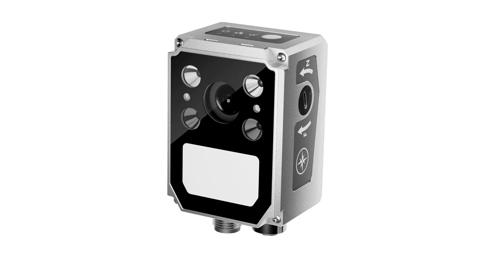[Button: ][Button: ]
- [Button: ]
- [Button: ]
- [Button: ]
- [Button: ]

[Button: - New Optical System X-Tech™]- 3×3×3 Flexible Configuration to suit any application

[Video: assets/goods-rs100/20240909015239381_333.mp4]

[Button: ][Button: ]

[Video: assets/goods-rs100/20240903121405655_rs100-x1.mp4]

- Super Resolution Lens: Read challenging barcodes at long range
- Using a 12/16mm 8MP lens with precision optical design, it utilizes 100% CMOS sensor performance. Compared to a 1.2MP lens in the same class product, which only utilizes 70% of the CMOS sensor performance, the RS100 has stronger resolution, better image quality, and more stable reading of difficult barcodes at long distances

[Video: assets/goods-rs100/20240903121411896_rs100-x2.mp4]

- Wild FoV lens: Read multiple barcodes at close range
- Using a 6mm lens, customized CMOS sensor and accelerated hardcore, the field of view for reading barcodes is more than 30% larger than that of similar products, capable of reading more than 40 barcodes at a time.

[Video: assets/goods-rs100/20240903121430719_rs100-x3.mp4]

- Example of optimal decoding of 3 light sources with optional overlapping of light sources
- 

[Video: assets/goods-rs100/20240903121405655_rs100-x1.mp4]

- Super Resolution Lens: Read challenging barcodes at long range
- Using a 12/16mm 8MP lens with precision optical design, it utilizes 100% CMOS sensor performance. Compared to a 1.2MP lens in the same class product, which only utilizes 70% of the CMOS sensor performance, the RS100 has stronger resolution, better image quality, and more stable reading of difficult barcodes at long distances

[Video: assets/goods-rs100/20240903121411896_rs100-x2.mp4]

- Wild FoV lens: Read multiple barcodes at close range
- Using a 6mm lens, customized CMOS sensor and accelerated hardcore, the field of view for reading barcodes is more than 30% larger than that of similar products, capable of reading more than 40 barcodes at a time.

[Video: assets/goods-rs100/20240903121430719_rs100-x3.mp4]

- Example of optimal decoding of 3 light sources with optional overlapping of light sources
- 

- [Button: ]
- [Button: ]
- [Button: ]
- [Button: ]

[Button: - OneClick Plus]- New OneClick+ with Quick & Max mode, faster and more stable barcode reading
[Button: ][Button: ]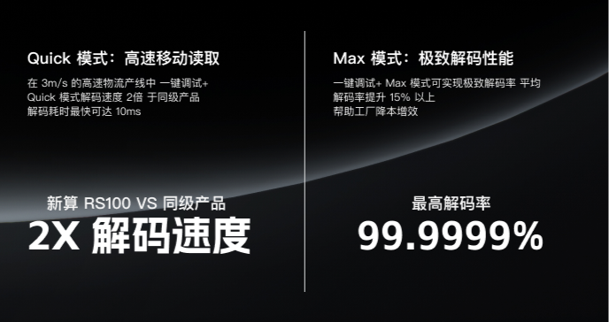- New OneClick+ with Quick & Max mode, faster and more stable barcode reading
- Faster: double the decoding speed, more stable: the ultimate stable decoding, more suitable for mobile reading
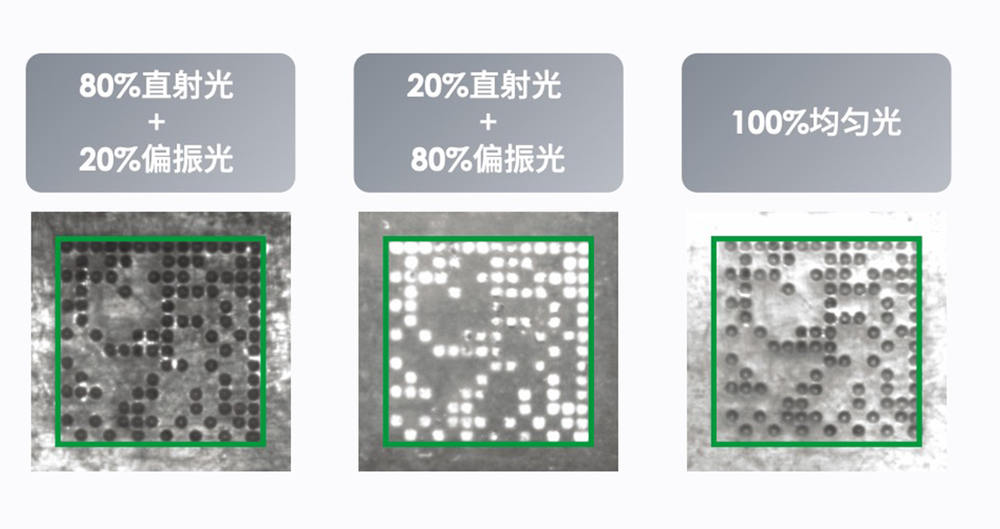- Combined Lighting Tuning
- The algorithm gives the barcode reader an "intelligent brain", OneClick adaptive unlimited combination of light sources, can independently according to the barcode reading samples, working conditions, intelligent selection of the optimal light source intensity and type of light source, greatly enhancing the decoding performance to quickly make the optimal choice, the algorithm application is not redundant and more streamlined
- Auto Algorithm
- Automatically matches CV/AI decoding algorithms
- Auto Parameter
- Over 1,920,000 parameter configurations to automatically optimize exposure, gain and other parameters for challenging barcodes
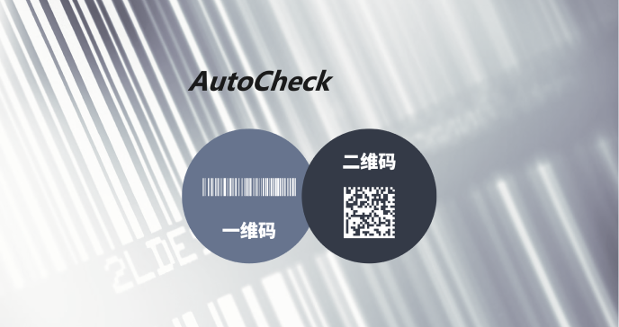- Automatically detect barcode types
- Automatically detect 1D/2D codes and retrieve predefined barcode template libraries based on barcode types to improve reading speed

- [Button: ]
- [Button: ]
- [Button: ]

[Button: - Auto Barcode Type Detection]- Automatically detect 1D barcode/2D barcode, according to the barcode type to call the predefined barcode template library, to improve the reading speed

[Video: assets/goods-rs100/20240903121758289_rs100-x4.mp4]

- Precision Infinite Focus
- Automatically detect 1D barcode/2D barcode, according to the barcode type to call the predefined barcode template library, to improve the reading speed
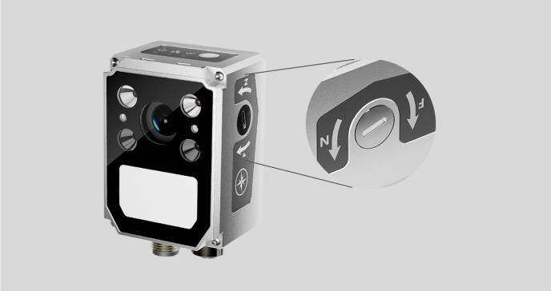- Auto/Mechanical focus
- With an Infinite Focus Ring System improves operational accuracy
[Button: - Convenience function][Button: ][Button: ]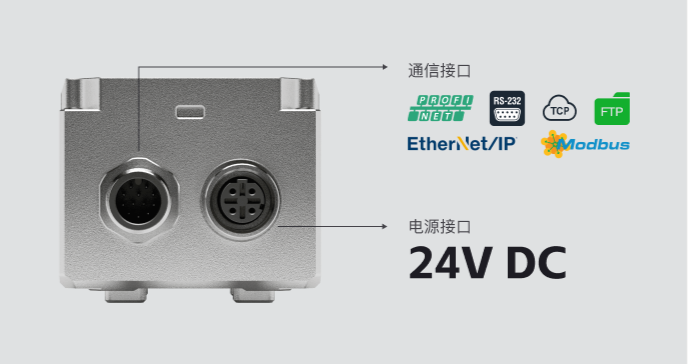- Dual Aviation plugs support rich communication protocols
- High-standard Dual Aviation plugs, stable and reliable, no need to worry about shedding downtime problems
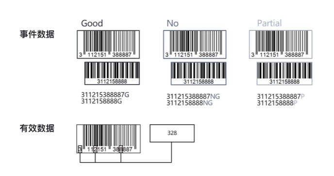- Formatting Data Functions
- Provide multiple data editing formats for more efficient data management
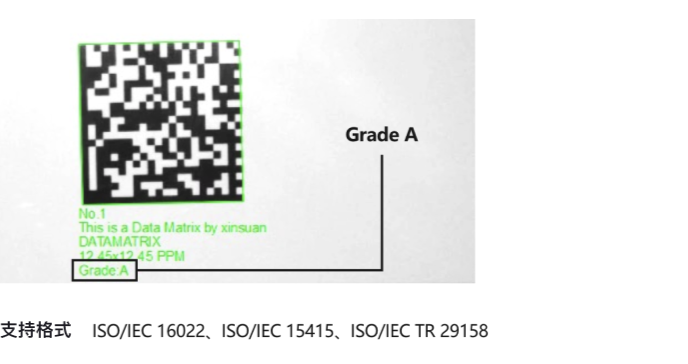- Engraving verification function
- Ensure 1D/2D barcode quality, timely detection of printing defects, and reduce waste
- Dual Aviation plugs support rich communication protocols
- High-standard Dual Aviation plugs, stable and reliable, no need to worry about shedding downtime problems
- Formatting Data Functions
- Provide multiple data editing formats for more efficient data management
- Engraving verification function
- Ensure 1D/2D barcode quality, timely detection of printing defects, and reduce waste

- [Button: ]
- [Button: ]
- [Button: ]
- [Button: ]

[Button: - Applications][Button: ][Button: ]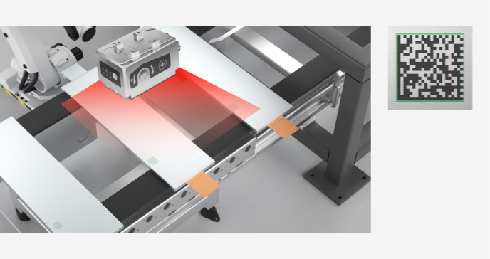- Easy Reflective Surfaces
- Metal surfaces are susceptible to reflective interference, which is reduced and stabilized by the polarized light of the adaptive combination light source
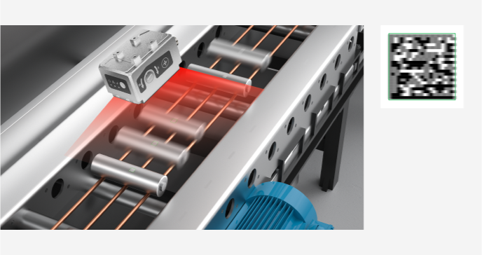- Movement reading
- Powerful decoding performance to read rotating cylindrical lithium batteries
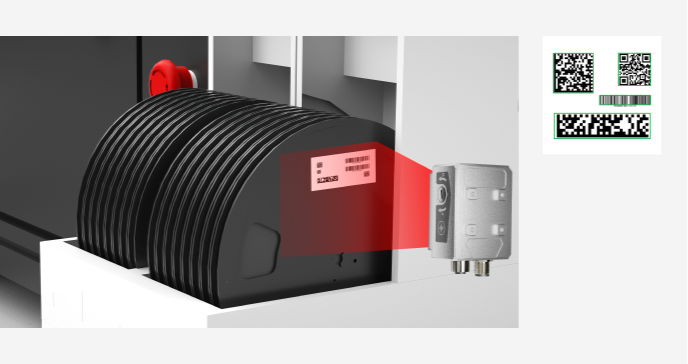- Multiple barcodes simultaneous reading
- Multiple types of 1D/2D barcodes on SMT trays can be read simultaneously by the RS100
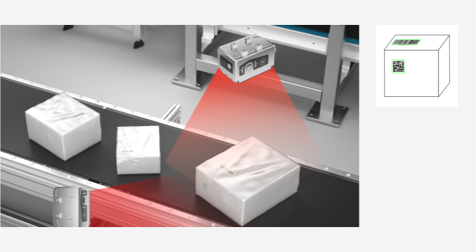- Multi-drop function
- RS100 supports Multi-drop function and can read 1D/2D barcode of different sides of express box through multiple Industrial Barcode Reader at the same time, which is very suitable for logistics industry
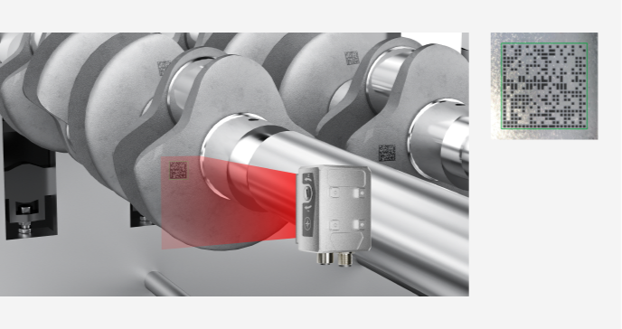- Metal pin
- The RS100's powerful decoding performance can solve the problems caused by poor quality of the firing pin marking process, such as the inability to decode and slow reading speed of metal parts
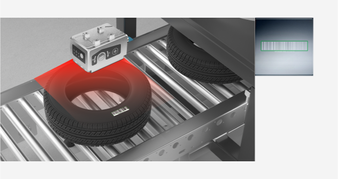- Multi-color resin
- 1D barcodes on tires are usually small, and the RS100 has a large depth of field and large pixels for stable reading
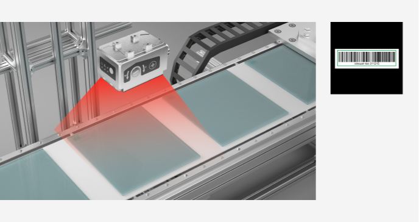- Glass surface reading
- 1D/2D barcode on glass with low contrast and severe reflection, read by polarized light, efficient and stable
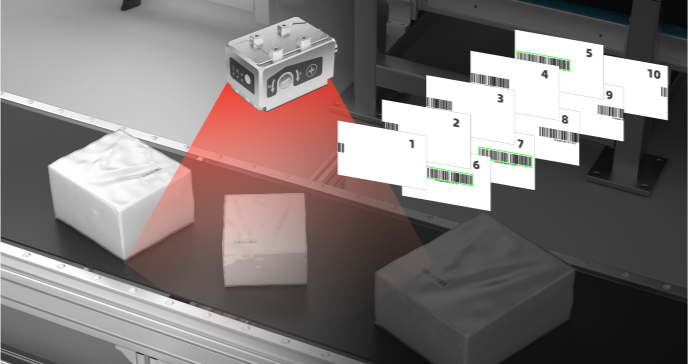- Burst mode reading
- Realize multiple decoding by taking pictures continuously, effectively solving the problem of missing pictures in the high-speed logistics line and improving the decoding stability

- [Button: ]
- [Button: ]
- [Button: ]
- [Button: ]

- Contact us for more product information and cooperation details
[Button: Prototype trial / Demo]- Hotline ：15381991195