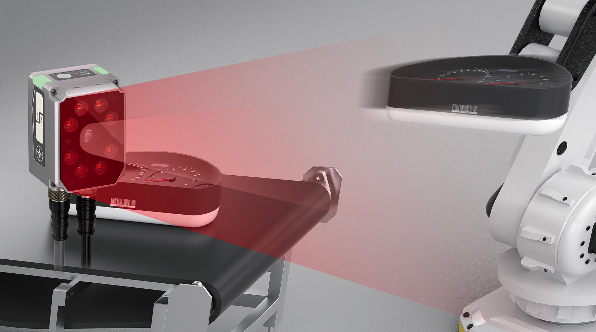
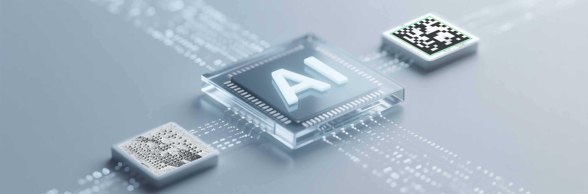

# 宁波新算技术有限公司

> Source: https://www.xs-code.com/#/goods/RS200

## 提取的关键数据

**电话:** 15381991195, 20230177

---

- Industrial Barcode Reader
- Techmology
- Customer Case
- Company Information
- Compact R-Series
- R275-A
- R172-E/S
- Dual Aviation plugs RS-Series
- RS100
- RS200
- RS60
- Handheld H-Series
- H920 无线/有线
- H620 无线/有线
- Aboutus
- News
- Exhibition
- Contact us
Customer reporting[Input(text): ]English- Back
- RS200 fixed stable code reader
- RS210
- RS220
- RS250
- RS290
- Modular code reading platform - New one-click debugging - New AI decoding technology
- 
[Button: Prototype trial / Demo][Button: ][Button: ]
- [Button: ]
- [Button: ]
- [Button: ]
- [Button: ]

[Button: - X-Scan™ code reading platform]- Equipped with a customized high-quality image sensor and flexible optical system X-Tech™, with flexible options for optical components, lens groups, and accessories, it meets over 90% of code reading needs in various scenarios.
[Button: - New generation one-click debugging +]- Easier to use, more convenient, more versatile
[Button: ][Button: ]- Easier to use: just click and go
- One-touch start on the device button/host interface allows easy commissioning of the barcode reader without the need for FAEs and on-site engineers
- More convenient: fast and automatic debugging
- One-touch triggering automatically executes light source, focus optimization and algorithm matching, completing the entire debugging process in less than 10 seconds
- More versatile: comprehensive performance improvement
- Covering >90% of common decoding scenarios, based on the deep integration of AI + traditional algorithms, the overall deviation rate is <10%, ensuring long-term stable operation
- Adaptive AI + traditional algorithms
- Automatic matching machine vision algorithm engine™ AI/traditional/hybrid decoding algorithms
- Millions of parameters
- Over 1.92 million parameter configurations automatically optimize light source, exposure, gain and other parameters to handle challenging code reading situations
- Self-identification coding
- Automatically detects symbology types and accesses predefined template libraries to increase reading speed

- [Button: ]
- [Button: ]
- [Button: ]

[Button: - Partition lighting debugging]- RS200 is equipped with a controllable light source, featuring native built-in high-intensity direct light (upper half) and polarized light (lower half), allowing for more flexible and precise debugging, and a wider range of applicable scenarios
[Button: - New generation AI decoding technology]- Equipped with a new high-performance AI processor and a hybrid decoding architecture integrating AI and traditional algorithms, it demonstrates excellent decoding stability and speed for difficult-to-read codes in industrial sites.
- NewCompute Machine Vision Algorithm Engine™
- Built-in over 1.92 million decoding configuration parameters, higher decoding efficiency and shorter decoding time
- AI decoding technology
- Enable one-click debugging + Max mode to build a "decoding visual agent" to significantly improve the decoding rate of extremely difficult codes.
[Button: - Applications][Button: ][Button: ]- Easy Reflective Surfaces
- Metal surfaces are susceptible to reflective interference, which is reduced and stabilized by the polarized light of the adaptive combination light source
- Movement reading
- Powerful decoding performance to read rotating cylindrical lithium batteries
- Multiple barcodes simultaneous reading
- Multiple types of 1D/2D barcodes on SMT trays can be read simultaneously by the RS100
- Multi-drop function
- RS100 supports Multi-drop function and can read 1D/2D barcode of different sides of express box through multiple Industrial Barcode Reader at the same time, which is very suitable for logistics industry
- Metal pin
- The RS100's powerful decoding performance can solve the problems caused by poor quality of the firing pin marking process, such as the inability to decode and slow reading speed of metal parts
- Multi-color resin
- 1D barcodes on tires are usually small, and the RS100 has a large depth of field and large pixels for stable reading
- Glass surface reading
- 1D/2D barcode on glass with low contrast and severe reflection, read by polarized light, efficient and stable
- Burst mode reading
- Realize multiple decoding by taking pictures continuously, effectively solving the problem of missing pictures in the high-speed logistics line and improving the decoding stability

- [Button: ]
- [Button: ]
- [Button: ]
- [Button: ]

- Contact us for more product information and cooperation details
[Button: Prototype trial / Demo]- Hotline ：15381991195