# 宁波新算技术有限公司

> Source: https://www.xs-code.com/#/goods/RS60

## 提取的关键数据

**电话:** 15381991195, 20230177

---

- Industrial Barcode Reader
- Techmology
- Customer Case
- Company Information
- Compact R-Series
- R275-A
- R172-E/S
- Dual Aviation plugs RS-Series
- RS100
- RS200
- RS60
- Handheld H-Series
- H920 无线/有线
- H620 无线/有线
- Aboutus
- News
- Exhibition
- Contact us
Customer reporting[Input(text): ]English- Back
- RS60 Universal (Primary 3C Applications)
- RS60-U U口
- RS60-E 网口
- RS60-S 串口
- RS60-UD U口直出线缆款
- OneClick × Cable Out Design × Ultra Cost-Effective
- 
[Button: Prototype trial / Demo]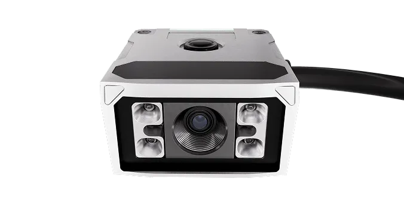[Button: ][Button: ]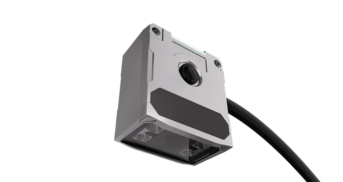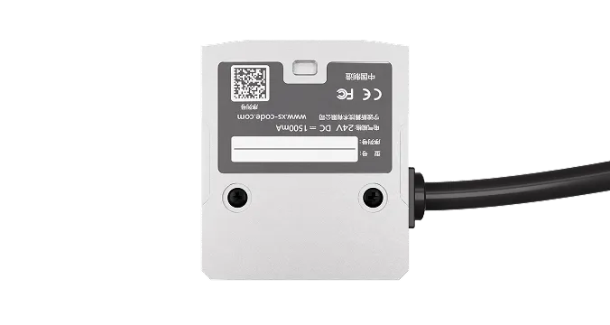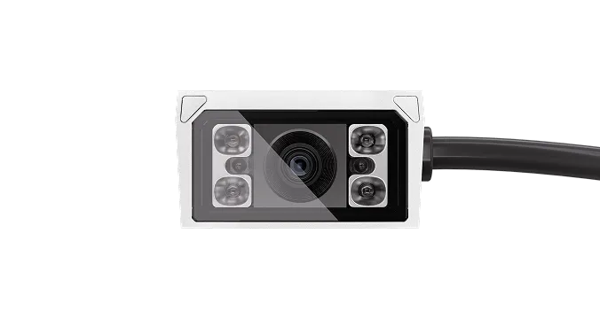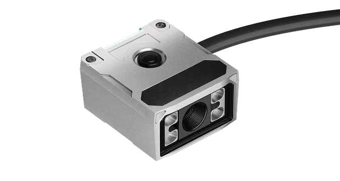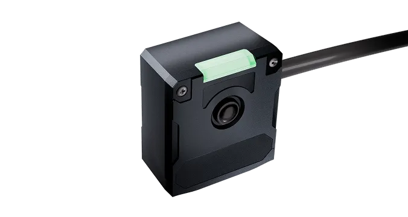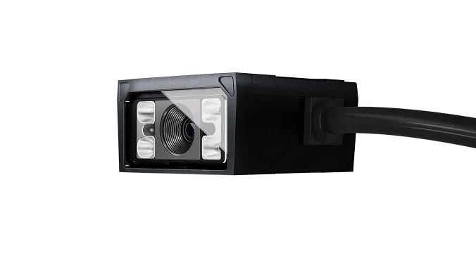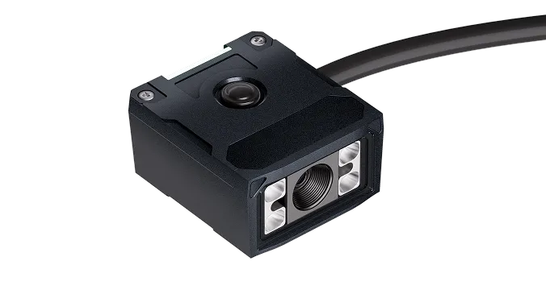
- [Button: ]
- [Button: ]
- [Button: ]
- [Button: ]

[Button: - OneClick]- New! OneClick of Auto algorithm is specially optimized for 3C scenarios
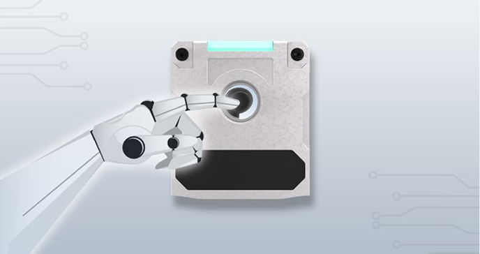- OneClick and Decoding
- The physical button design triggers OneClick for efficient reading of difficult 1D/2D codes, making it suitable for semi-automatic workstations
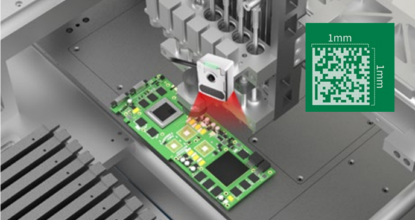- Small Code
- Electronic product codes are usually small. RS60 can read 1mm 1D/2D codes through lens combination design and excellent algorithm.
[Button: - More functions, OneClick][Button: ][Button: ]- Auto Algorithm
- Automatically matches CV/AI decoding algorithms
- Auto Parameter
- Over 860,000 parameter configurations, automatically optimizing exposure, gain and other parameters to handle challenging code reading situations
- Self-identification coding
- Automatically detect 1D/2D codes and retrieve predefined barcode template libraries based on barcode types to improve reading speed
- Auto Algorithm
- Automatically matches CV/AI decoding algorithms
- Auto Parameter
- Over 860,000 parameter configurations, automatically optimizing exposure, gain and other parameters to handle challenging code reading situations
- Self-identification coding
- Automatically detect 1D/2D codes and retrieve predefined barcode template libraries based on barcode types to improve reading speed

- [Button: ]
- [Button: ]
- [Button: ]
- [Button: ]

[Button: - Cable Out Design]- More flexible deployment in 3C applications
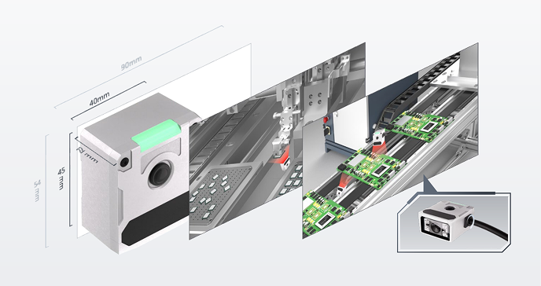- Compact size and integrated structure, more suitable for compact production lines, machines and jigs
[Button: - Ultra Cost-Effective][Button: ][Button: ]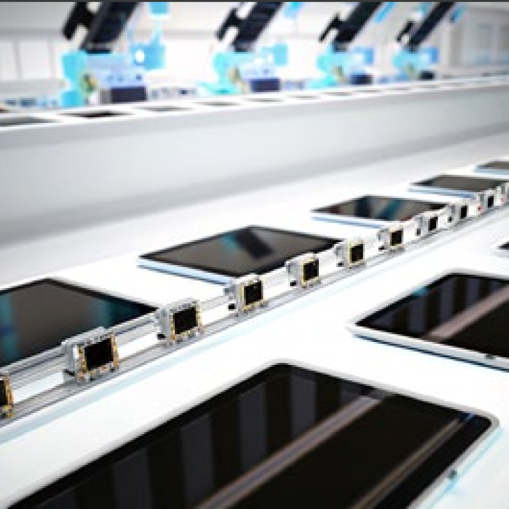- Smartphone
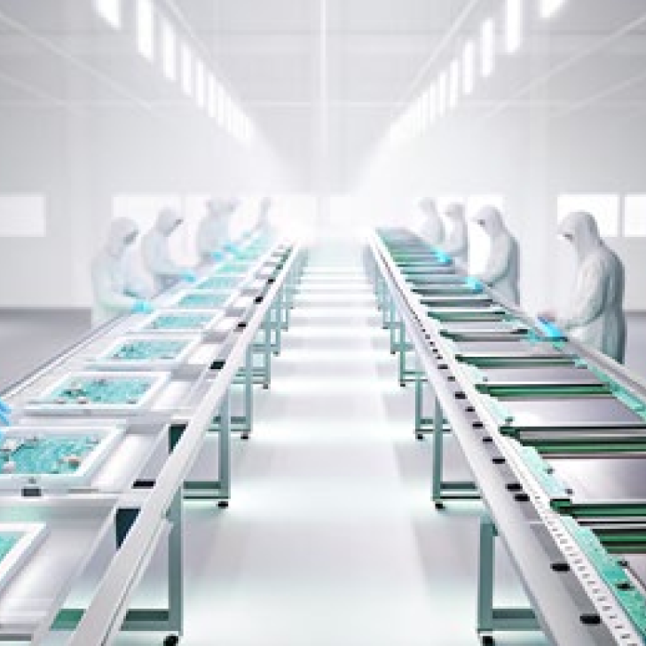- Computer
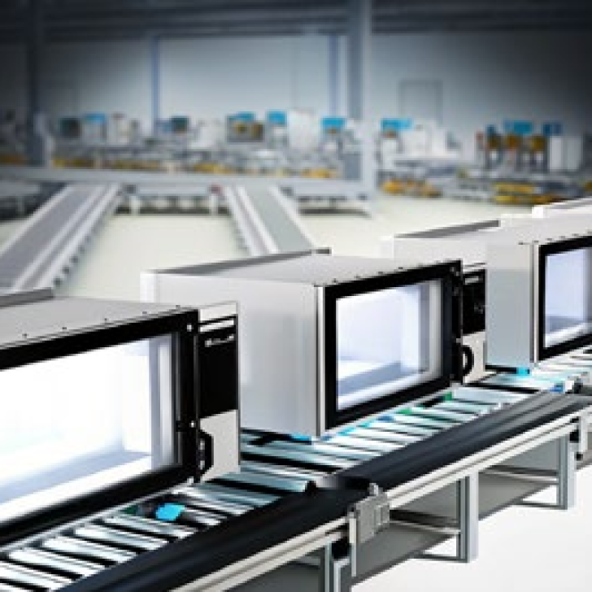- Kitchen appliances
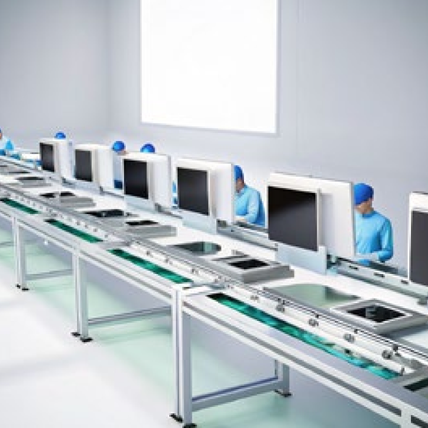- Living room appliances
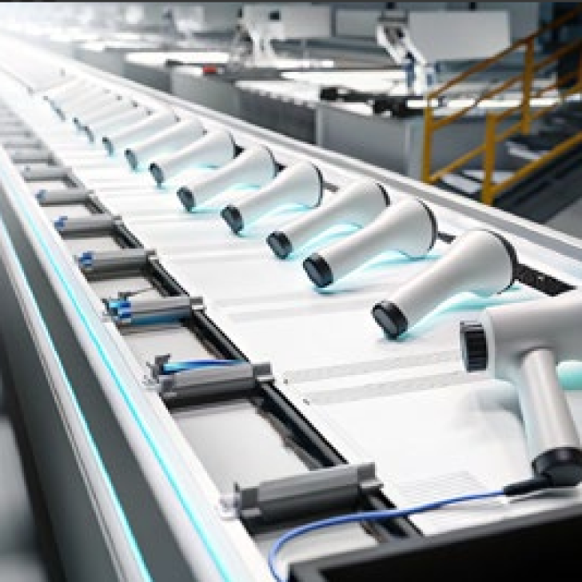- Personal care appliances
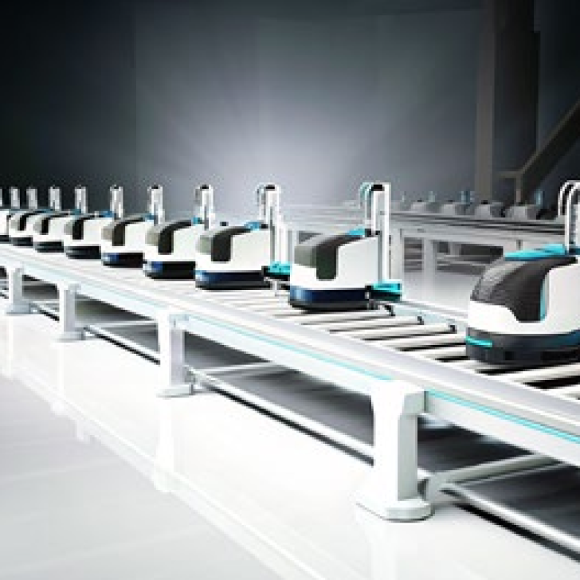- Cleaning appliances
- Smartphone
- Computer
- Kitchen appliances
- Living room appliances
- Personal care appliances
- Cleaning appliances

- [Button: ]
- [Button: ]
- [Button: ]
- [Button: ]

- Contact us for more product information and cooperation details
[Button: Prototype trial / Demo]- Hotline ：15381991195