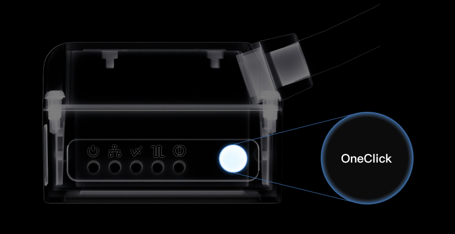
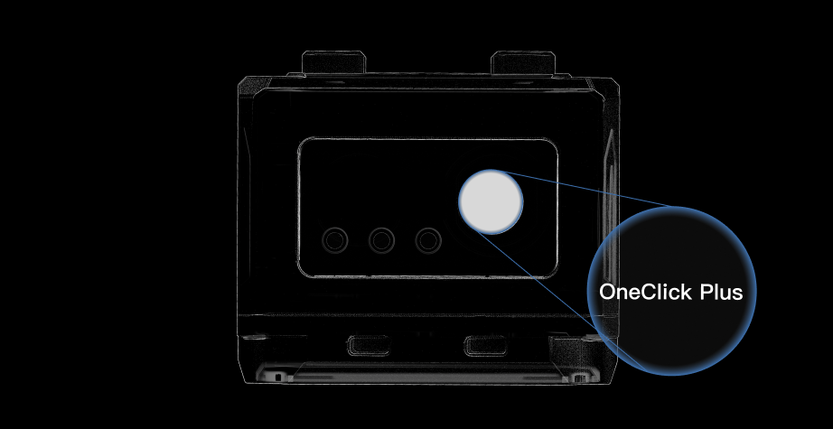
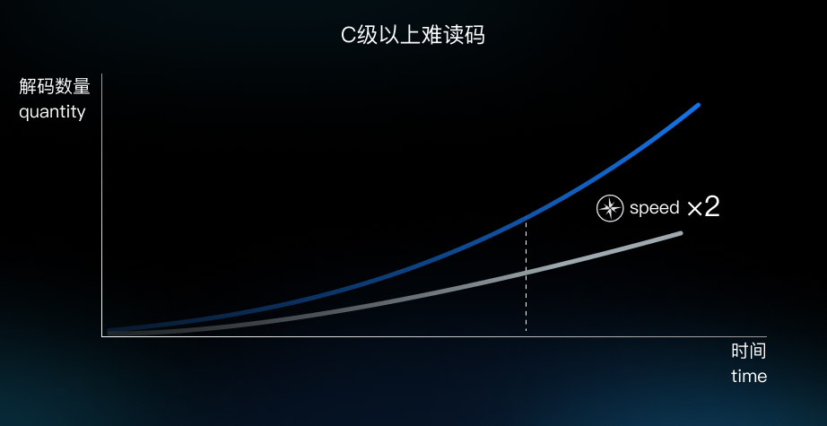
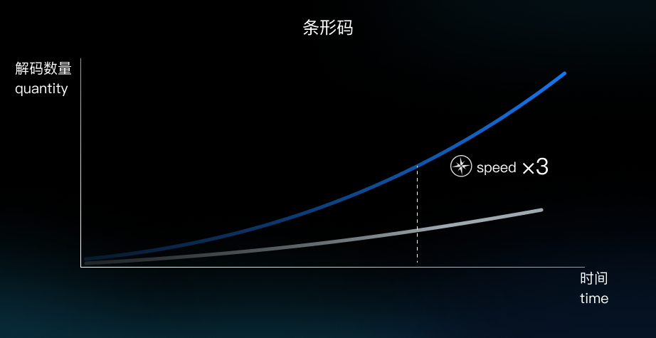
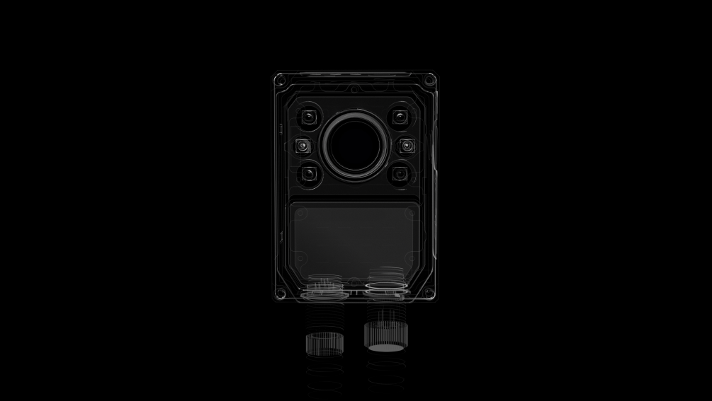

# 宁波新算技术有限公司

> Source: https://www.xs-code.com/#/technical

## 提取的关键数据

**电话:** 15381991195, 20230177

---

- Industrial Barcode Reader
- Techmology
- Customer Case
- Company Information
- Compact R-Series
- R275-A
- R172-E/S
- Dual Aviation plugs RS-Series
- RS100
- RS200
- RS60
- Handheld H-Series
- H920 无线/有线
- H620 无线/有线
- Aboutus
- News
- Exhibition
- Contact us
Customer reporting[Input(text): ]English- Full-stack software and hardware self-development, powerful performance
- Machine Vision Algorithm Engine™
- Completely self-developed decoding algorithm IP, strong performance, stable decoding
- Ultra-Resolution Algorithm ™️
- Equivalent 3MP lens reading effect, support for reading the smallest size unit 1mil 1D barcode, 1.5mil 2D barcode 1MP lens = 3MP lens imaging effect, 3 times the imaging quality enhancement
- Patented SPL technology ™️
- Patented sub-pixel positioning technology with an accuracy of 0.02 Pixel, even with 30% defective finder pattern (L-shaped)
- Patented Contrast Enhancement Algorithm
- Enable stable reading of barcodes with as low as 2% contrast, and algorithms that enhance the visibility of a nearly invisible DM barcode (with 2% contrast) to the point where it can be clearly seen and successfully decoded
- OneClick
- Not only adjusts the illumination source, but also automatically adjusts algorithms and parameters for optimal decoding
- Auto light adjustment
- Flexible combination of light sources to adaptive, highly configurable to cope with any application
- Auto Parameter
- Over 1,920,000 parameter configurations to automatically optimize exposure, gain and other parameters for challenging barcodes
- Auto Algorithm
- Automatically matches CV/AI decoding algorithms
- Autofocus
- Automatically adapts to various barcode sizes under any working distances
- Auto Barcode Type Detection
- Automatically detect 1D barcode/2D barcode, according to the barcode type to call the predefined barcode template library, to improve the reading speed
- Combined Lighting Tuning
- According to the barcode reading samples and working conditions, automatic selection of the optimal light source intensity and light source type, greatly enhancing the decoding performance
- Not only adjusts the illumination source, but also automatically adjusts algorithms and parameters for optimal decoding
- Ultimate Ease of Use
- Decode with just the body or software buttons
[Button: ][Button: ][Button: ][Button: ]- Ultimate performance
- For barcodes of class C or above, the average decoding time for OneClick Max is 20ms, which is 2 times faster than that of products of the same class.
- For barcodes, the average decoding time of OneClick Quick is 10ms, which is 3 times faster than that of products of the same level Challenging barcodes above class C
- New Optical SystemX-Tech™
- A variety of lens specifications, light source color and light source type, flexible combination of high configurability to suit any application
- Flexible Configuration
- Multiple lens focal lengths, light source colors, and light source types to meet diverse needs
- 3×3×3 Flexible configuration
- Length
- 6mm
- 12mm
- 16mm
- Color
- red
- white
- technical.p4.card.list[1].opts[2].name
- Type
- direct
- polarized
- Combined Lighting Tuning
- Pioneering technology greatly improves decoding stability and performance
- Pioneering technology greatly improves decoding stability and performance,Compared with conventional single light source decoding, combined lighting tuning With OneClick Max, which enables automatically select light source intensity and light source type, can greatly improve the stability and performance of decoding
- 50% direct light + 50% polarized light
- On-axis aiming
- Read where you point, scan what you see
- Flagship Aiming Performance: Completely improve the traditional handheld barcode reader aiming shift problem, no longer worry about missing scanning errors
- Contact us for more product information and cooperation details
[Button: Prototype trial / Demo]- Hotline ：15381991195